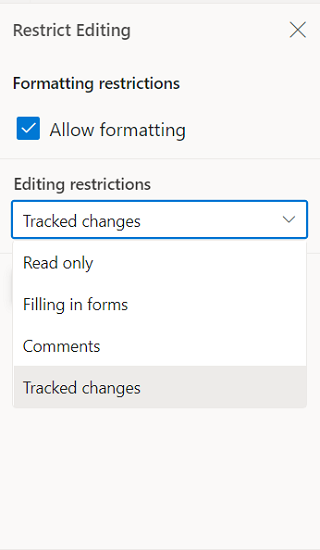

# Track Changes in Angular Document Editor

[Angular DOCX Editor](https://www.syncfusion.com/docx-editor-sdk/angular-docx-editor) (Document Editor) supports Track Changes functionality, which allows you to keep a record of changes or edits made to a document. You can then choose to accept or reject these modifications. It is a useful tool for managing changes made by several reviewers to the same document. When the Track Changes option is enabled, all editing operations are preserved as revisions.

## Enable Track changes

Track changes can be enabled using the [enableTrackChanges](https://ej2.syncfusion.com/angular/documentation/api/document-editor-container/index-default#enabletrackchanges) property. When enabled, all editing operations are recorded and preserved as revisions in the Document Editor.

The following example demonstrates how to enable track changes.

```typescript
<ejs-documenteditor [enableTrackChanges]="true" height="330px" style="display:block"></ejs-documenteditor>
```

N> Track changes are document-level settings. When opening a document, if the document does not have track changes enabled, then `enableTrackChanges` will be disabled even if you set `enableTrackChanges: true` in the initial rendering. If you want to enable track changes for all documents, we recommend enabling track changes in the `documentChange` event.

The following example demonstrates how to enable track changes for all the documents while opening.

```typescript
<ejs-documenteditorcontainer #documenteditor_default [enableToolbar]=true [locale]="culture" (created)="onCreate()" (documentChange)="onDocumentChange()" height="600px" [serviceUrl]="hostUrl"  style="display:block;"></ejs-documenteditorcontainer>

onDocumentChange(): void {
  if (this.container !== null) {
    this.container.documentEditor.enableTrackChanges = true;
  }
}
```

## Get all tracked revisions

The following example demonstrates how to get all tracked revisions from the current document.

```typescript
/**
 * Get revisions from the current document
 */
let revisions : RevisionCollection = this.documentEditor.revisions;
```

## Accept or Reject all changes

The following example demonstrates how to accept or reject all changes.

```typescript
/**
 * Get revisions from the current document
 */
let revisions : RevisionCollection = this.documentEditor.revisions;

/**
 * Accept all tracked changes
 */
revisions.acceptAll();

/**
 * Reject all tracked changes
 */
revisions.rejectAll();
```

## Accept or reject a specific revision

The following example demonstrates how to accept or reject a specific revision in the Document Editor.

```typescript
/**
 * Get revisions from the current document
 */
let revisions : RevisionCollection = this.documentEditor.revisions;
/**
 * Accept specific changes
 */
revisions.get(0).accept();
/**
 * Reject specific changes
 */
revisions.get(1).reject();
```

## Navigate between the tracked changes

The following example demonstrates how to navigate through tracked revisions programmatically.

```typescript
/**
 * Navigate to next tracked change from the current selection.
 */
this.documentEditor.selection.navigateNextRevision();

/**
 * Navigate to previous tracked change from the current selection.
 */
this.documentEditor.selection.navigatePreviousRevision();
```

## Filter Changes by User

The built-in review panel in the Document Editor supports filtering changes based on the user.



## Custom metadata along with author

The Document Editor allows customizing revisions using [revisionSettings](https://ej2.syncfusion.com/angular/documentation/api/document-editor/documenteditorsettingsmodel#revisionsettings). The [customData](https://ej2.syncfusion.com/angular/documentation/api/document-editor/revisionsettings#customdata) property allows attaching additional metadata to tracked revisions. This metadata can represent roles, tags, or any custom identifier for a revision. To display this metadata along with the author name in the Track Changes pane, the [showCustomDataWithAuthor](https://ej2.syncfusion.com/angular/documentation/api/document-editor/revisionsettings#showcustomdatawithauthor) property must be enabled.

The following example illustrates how to enable and update custom metadata for track changes revisions.

```ts
import { Component, OnInit, ViewChild } from '@angular/core';
import {
  ToolbarService,
  DocumentEditorContainerComponent,
} from '@syncfusion/ej2-angular-documenteditor';
import { DocumentEditorContainerModule } from '@syncfusion/ej2-angular-documenteditor';
@Component({
  selector: 'app-container',
  standalone: true,
  imports: [DocumentEditorContainerModule],
  providers: [ToolbarService],
  template: `<ejs-documenteditorcontainer #documenteditor_default 
      serviceUrl="hostUrl" 
      height="600px" 
      style="display:block" 
      [enableTrackChanges]=true
      [documentEditorSettings]= "Settings" >
    </ejs-documenteditorcontainer>
  `,
})
export class AppComponent implements OnInit {
  @ViewChild('documenteditor_default')
  public container?: DocumentEditorContainerComponent;
  public Settings = {
    revisionSettings: {
      customData: 'Developer',
      showCustomDataWithAuthor: true,
    }};
  ngOnInit(): void {}
}
```
The Track Changes pane will display the author name along with the custom metadata, as shown in the screenshot below.


N> When the document is exported as SFDT, the `customData` value is stored in the revision collection. Upon reopening the SFDT, the custom data is automatically restored and displayed in the Track Changes pane. In formats other than SFDT (such as DOCX and others), the `customData` is not preserved, as it is specific to the Document Editor component.

## Protect the document in track changes only mode

Document Editor provides support for protecting the document with `RevisionsOnly` protection. In this protection, all the users are allowed to view the document and do their corrections, but they cannot accept or reject any tracked changes in the document. Later, the author can view their corrections and accept or reject the changes.

The Document Editor provides an option to protect and unprotect the document using the [enforceProtection](https://ej2.syncfusion.com/angular/documentation/api/document-editor/editor#enforceprotection) and [stopProtection](https://ej2.syncfusion.com/angular/documentation/api/document-editor/editor#stopprotection) APIs.

The following example illustrates how to enforce and stop protection in the Document Editor container.

```typescript
import { Component, ViewEncapsulation, ViewChild } from '@angular/core';
import { DocumentEditorContainerComponent, ToolbarService } from '@syncfusion/ej2-angular-documenteditor';

@Component({
      selector: 'app-container',
      // specifies the template string for the Document Editor component
      template: `<div><button ejs-button (click)="protectDocument()" >Protect</button>
      <button ejs-button (click)="unProtectDocument()" >Unprotect</button>
      <ejs-documenteditorcontainer #document_editor serviceUrl="https://document.syncfusion.com/web-services/docx-editor/api/documenteditor/" height="600px" style="display:block" [enableToolbar]=true> </ejs-documenteditorcontainer></div>`,
      encapsulation: ViewEncapsulation.None,
      providers: [ToolbarService]
})
export class AppComponent {
    @ViewChild('document_editor')
    public container: DocumentEditorContainerComponent;

    public protectDocument(): void {
        //enforce protection
        container.documentEditor.editor.enforceProtection('123', 'RevisionsOnly');
    }

    public unProtectDocument(): void {
        //stop the document protection
        container.documentEditor.editor.stopProtection('123');
    }
}
```

N> The Web Service link `https://document.syncfusion.com/web-services/docx-editor/api/documenteditor/` used in the serviceUrl property is intended solely for demonstration and evaluation purposes. For production deployment, please host your own Web Service with your required server configurations. You can refer and reuse the [GitHub Web Service example](https://github.com/SyncfusionExamples/EJ2-DocumentEditor-WebServices) or [Docker image](https://hub.docker.com/r/syncfusion/word-processor-server) for hosting your own Web Service and use it for the serviceUrl property.

Tracked changes only protection can be enabled in UI by using [Restrict Editing pane](./document-management#restrict-editing-pane)


N> In the `enforceProtection` method, the first parameter denotes the password and the second parameter denotes the protection type. Possible values of the protection type are `NoProtection | ReadOnly | FormFieldsOnly | CommentsOnly | RevisionsOnly`. In the `stopProtection` method, the parameter denotes the password.

## Restrict accept or reject by author

Restrict accepting or rejecting changes by author name.

The following example demonstrates how to restrict an author from accepting or rejecting changes.

```typescript
import { Component, OnInit, ViewChild } from '@angular/core';
import {
  ToolbarService,
  DocumentEditorContainerComponent,
} from '@syncfusion/ej2-angular-documenteditor';
import { ClickEventArgs } from '@syncfusion/ej2-navigations';
import {
  CustomToolbarItemModel,
  DocumentEditorContainerModule,
} from '@syncfusion/ej2-angular-documenteditor';

@Component({
  selector: 'app-container',
  standalone: true,
  imports: [DocumentEditorContainerModule],
  providers: [ToolbarService],
  template: `
    <ejs-documenteditorcontainer #documenteditor_default 
      serviceUrl="https://document.syncfusion.com/web-services/docx-editor/api/documenteditor/" 
      height="600px" 
      style="display:block" 
      (beforeAcceptRejectChanges)="beforeAcceptRejectChanges($event)"
      [enableToolbar]="true">
    </ejs-documenteditorcontainer>
  `,
})
export class AppComponent implements OnInit {
  @ViewChild('documenteditor_default')
  public container?: DocumentEditorContainerComponent;

  ngOnInit(): void {}
  beforeAcceptRejectChanges(args: { author: string; cancel: boolean }) {
    // Check the author of the revision
    if (args.author !== 'Hary') {
      // Cancel the accept/reject action
      args.cancel = true;
    }
  }
}
```

## Online Demo

Explore how to track and review changes in Word documents using the Angular Document Editor in this live demo [here](https://document.syncfusion.com/demos/docx-editor/angular/#/tailwind3/document-editor/track-changes).