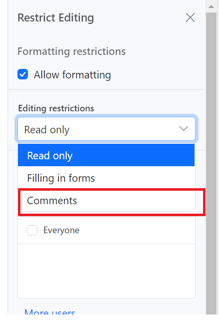

# Comments in ASP.NET Core DOCX Editor Component

[ASP.NET Core DOCX Editor](https://www.syncfusion.com/docx-editor-sdk/asp-net-core-docx-editor) (Document Editor) lets you add comments to documents. You can add, navigate, and remove comments in code and from the UI.

## Add a new comment

Comments can be inserted to the selected text.

```typescript
documentEditor.editor.insertComment('Test comment');
```

## Add a New Comment with Date, Author, and Status

Comments can be inserted into the selected text with a specified date, author, and status using `insertComment`.

```typescript
// In this example, a comment with the text "Hello world"
// is added by the author Nancy Davolio on July 23, 2024, at 2:30 PM. 
// The isResolved status is set to false.

// Create a specific date: July 23, 2024, at 2:30:00 PM.
// Note: July is represented by 6 (0-based index).
var specificDate = new Date(2024, 6, 23, 14, 30, 0); 


// Define the properties of the comment including author, date, and resolution status.
var commentProperties = { 
    author: 'Nancy Davolio',          // The author of the comment.
    dateTime: specificDate,           // The date and time when the comment is created.
    isResolved: false                 // The status of the comment; false indicates it is unresolved.
};

// Insert the comment with the specified properties into the DOCX Editor.
documentEditor.editor.insertComment('Hello world', commentProperties);
```

## Add a Reply Comment with Date, Author, and Status

Reply comments can be inserted into the parent comment with a specified date, author, and status using `insertReplyComment`.

```typescript
// In this example, a comment with the text "Hello world"
// is added by the author Nancy Davolio on July 23, 2024, at 2:30 PM. 
// The isResolved status is set to false.

// Create a specific date: July 23, 2024, at 2:30:00 PM.
// Note: July is represented by 6 (0-based index).
var specificDate = new Date(2024, 6, 23, 14, 30, 0);

// Define the properties of the comment including author, date, and resolution status.
var commentProperties = { 
    author: 'Nancy Davolio',          // The author of the comment.
    dateTime: specificDate,           // The date and time when the comment is created.
    isResolved: false                 // The status of the comment; false indicates it is unresolved.
};

// Insert the comment with the specified properties into the DOCX Editor.
var comment = documentEditor.editor.insertComment('Hello world', commentProperties);
// Insert a reply comment with specified properties into the DOCX Editor
documentEditor.editor.insertReplyComment(comment.id, 'Hello world', commentProperties);
```

## Get Comments

DOCX Editor lets you get the comments along with their replies and comment properties using `getComments`. The returned object is an array of comments, where each comment exposes `id`, `author`, `dateTime`, `isResolved`, and a `replies` array containing the reply comments with the same properties.

```typescript
//Get Comments in the document along with the properties author, date, status.
var commentinfo = container.documentEditor.getComments();
```

## Comment navigation

Next and previous comments can be navigated using the below code snippet.

```typescript
//Navigate to next comment
documentEditor.selection.navigateNextComment();

//Navigate to previous comment
documentEditor.selection.navigatePreviousComment();
```

## Delete a comment

Current comment can be deleted using `deleteComment`.

```typescript
//Delete the current selected comment.
container.documentEditor.editor.deleteComment();

//Get Comments in the document along with the properties author, date, status.
let commentinfo = container.documentEditor.getComments();

//Delete the particular parent comments and all of its reply comments
container.documentEditor.editor.deleteComment(commentinfo[0].id);

//Delete the particular reply comment.
container.documentEditor.editor.deleteComment(commentinfo[0].replies[0].id);
```

## Delete all comments

All the comments in the document can be deleted using the below code snippet.

```typescript
documentEditor.editor.deleteAllComments();
```

## Protect the document in comments only mode

DOCX Editor provides support for protecting the document with `CommentsOnly` protection. In this protection, the user can only add or edit comments in the document.

DOCX Editor provides an option to protect and unprotect the document using `enforceProtection` and `stopProtection` API.












Comment only protection can be enabled in UI by using [Restrict Editing pane](../asp-net-core/restrict-editing#restrict-editing-pane)



N> In enforce Protection method, first parameter denotes password and second parameter denotes protection type. Possible values of protection type are `NoProtection |ReadOnly |FormFieldsOnly |CommentsOnly`. In stop protection method, parameter denotes the password.

## Mention Support in comments

Mention support displays a list of items that users can select or tag from the suggested list. To use this feature, type the `@` character in the comment box and select or tag the user from the suggestion list.

The following example illustrates how to enable mention support in DOCX Editor












## Events

DocumentEditor provides `beforeCommentAction` event, which is triggered on comment actions like Post, edit, reply, resolve, and reopen, allowing you to perform custom logic on these actions. The event handler receives the `CommentActionEventArgs` object as an argument, which allows access to information about the comment.

To demonstrate a specific use case, let’s consider an example where we want to restrict the delete functionality based on the author’s name. The following code snippet illustrates how to allow only the author of a comment to delete:











## Online Demo

Explore how to add, view, and manage comments in Word documents using the ASP.NET Core DOCX Editor in this live demo [here](https://document.syncfusion.com/demos/docx-editor/asp-net-core/documenteditor/comments#/tailwind3).