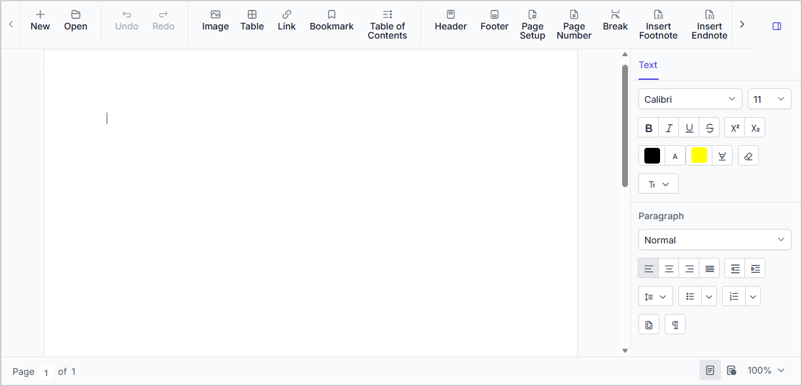

# Getting Started with ASP.NET Core DOCX Editor

[ASP.NET Core DOCX Editor](https://www.syncfusion.com/docx-editor-sdk/asp-net-core-docx-editor) (Document Editor) enables you to create, edit, view, and print Word documents in web applications. This section guides you through the steps to get started and create a DOCX Editor in an ASP.NET Core application.

## Prerequisites

* [System requirements for ASP.NET Core controls](https://ej2.syncfusion.com/aspnetcore/documentation/system-requirements)
* [Browser compatibility](https://ej2.syncfusion.com/aspnetcore/documentation/browser)





## Create a new ASP.NET Core Web App in Visual Studio

Create an ASP.NET Core Web App using Visual Studio 2022 by following the instructions [here](https://learn.microsoft.com/en-us/visualstudio/get-started/csharp/tutorial-aspnet-core?view=visualstudio).

## Install ASP.NET Core DOCX Editor NuGet package

To add the ASP.NET Core DOCX Editor component, open the NuGet package manager in Visual Studio (*Tools → NuGet Package Manager → Manage NuGet Packages for Solution*), then search for and install:

* [Syncfusion.EJ2.AspNet.Core](https://www.nuget.org/packages/Syncfusion.EJ2.AspNet.Core/)

N> This package includes dependencies such as [Newtonsoft.Json](https://www.nuget.org/packages/Newtonsoft.Json/) for JSON serialization and [Syncfusion.Licensing](https://www.nuget.org/packages/Syncfusion.Licensing/) for license validation.





## Create a new ASP.NET Core Web App in Visual Studio Code

Create an **ASP.NET Core Web App** in Visual Studio Code using the following commands:




dotnet new webapp -o WebApp
cd WebApp




## Install ASP.NET Core DOCX Editor NuGet package

Install the Syncfusion&reg; ASP.NET Core component NuGet package within the project.

* Press <kbd>Ctrl</kbd>+<kbd>`</kbd> to open the integrated terminal in Visual Studio Code.
* Ensure you’re in the project root directory where your `.csproj` file is located.
* Run the following command to install the [Syncfusion.EJ2.AspNet.Core](https://www.nuget.org/packages/Syncfusion.EJ2.AspNet.Core/) NuGet package.




dotnet add package Syncfusion.EJ2.AspNet.Core -v {{ site.releaseversion }}
dotnet restore




N> This package includes dependencies such as [Newtonsoft.Json](https://www.nuget.org/packages/Newtonsoft.Json/) for JSON serialization and [Syncfusion.Licensing](https://www.nuget.org/packages/Syncfusion.Licensing/) for license validation.





## Add Syncfusion&reg; ASP.NET Core Tag Helper

Open `~/Pages/_ViewImports.cshtml` file and import the `Syncfusion.EJ2` TagHelper.




@addTagHelper *, Syncfusion.EJ2




## Register a Syncfusion License Key

Before initializing the ASP.NET Core DOCX Editor control, generate a Syncfusion license key and register it in your application.

- [Generate a Syncfusion License Key](https://help.syncfusion.com/document-processing/licensing/how-to-generate)
- [Register a Syncfusion License Key in an ASP.NET Core Application](https://help.syncfusion.com/document-processing/licensing/how-to-register-in-an-application#aspnet-core)

## Add stylesheet and script resources

Reference the Syncfusion theme and JavaScript library using the CDN inside the `<head>` of `~/Pages/Shared/_Layout.cshtml`. The stylesheet provides styling for all Syncfusion components including the DOCX Editor, and the script provides the client-side functionality.




<!-- Syncfusion ASP.NET Core controls styles -->
<link rel="stylesheet" href="https://cdn.syncfusion.com/ej2/{{ site.ej2version }}/fluent.css" />
<!-- Syncfusion ASP.NET Core controls scripts -->




To use a different theme, replace `fluent.css` with the theme of your choice (for example, `tailwind3.css`, `bootstrap5.css`, etc.) in the above code.

N> Refer the [Themes topic](https://ej2.syncfusion.com/aspnetcore/documentation/appearance/theme) to learn the different ways to include Syncfusion styles (using [CDN](https://ej2.syncfusion.com/aspnetcore/documentation/common/adding-script-references#cdn-reference), [NPM package](https://ej2.syncfusion.com/aspnetcore/documentation/common/adding-script-references#node-package-manager-npm), or [CRG](https://ej2.syncfusion.com/aspnetcore/documentation/common/custom-resource-generator)) and ensure the expected appearance of Syncfusion&reg; ASP.NET Core controls, and check the [Adding Script Reference](https://ej2.syncfusion.com/aspnetcore/documentation/common/adding-script-references) documentation to understand the various approaches for adding required script references in your ASP.NET Core application.

## Register Syncfusion&reg; Script Manager

Also, register the script manager `<ejs-scripts>` at the end of `<body>` in the `~/Pages/Shared/_Layout.cshtml` file as follows.




<!-- Syncfusion ASP.NET Core Script Manager -->
<ejs-scripts></ejs-scripts>




## Add the DOCX Editor component

Add the DOCX Editor component in `~/Pages/Index.cshtml` page.




<ejs-documenteditorcontainer id="container" height="620px"></ejs-documenteditorcontainer>




## Run the application

Press <kbd>Ctrl</kbd>+<kbd>F5</kbd> (Windows) or <kbd>⌘</kbd>+<kbd>F5</kbd> (macOS) to run the app. The DOCX Editor component will be rendered in the default web browser as shown below.

N> [View Sample in GitHub](https://github.com/SyncfusionExamples/ASP-NET-Core-DOCX-Editor-Examples/tree/master/getting-started).

## Online Demo

Explore the live demo [here](https://document.syncfusion.com/demos/docx-editor/asp-net-core/documenteditor/default#/tailwind3) to see how to create, edit, and print Word documents using the ASP.NET Core DOCX Editor.

N> Looking for the full ASP.NET Core DOCX Editor component overview, features, pricing, and documentation? Visit the [ASP.NET Core DOCX Editor](https://www.syncfusion.com/docx-editor-sdk/asp-net-core-docx-editor) page.

## Troubleshooting

If the DOCX Editor control does not render as expected, use the following checklist to resolve the most common setup and configuration issues.

**1. Control not rendering (blank area where the DOCX Editor should appear)**
- Ensure the `<ejs-scripts>` tag is included at the end of `<body>` section in `~/Pages/Shared/_Layout.cshtml` to initialize client-side scripts.

**2. Tag helper not recognized**
- Ensure `@addTagHelper *, Syncfusion.EJ2` is included in `~/Pages/_ViewImports.cshtml`.
- Rebuild the project after installing the `Syncfusion.EJ2.AspNet.Core` NuGet package.

## See also

- [Open a document](./import)
- [Save a document](./export)
- [Collaborative Editing](./collaborative-editing/overview)