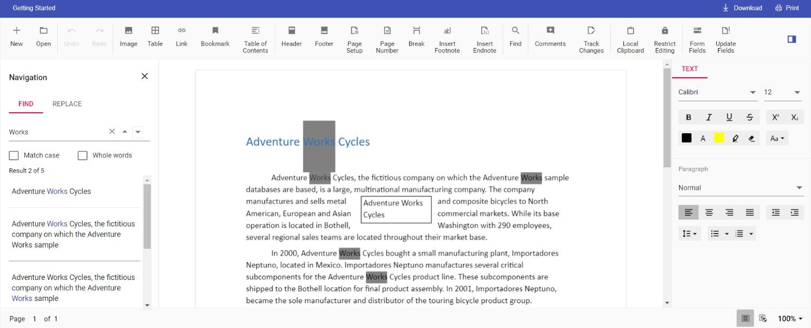

# How to Change Search Highlight Color in ASP.NET Core DOCX Editor

[ASP.NET Core DOCX Editor](https://www.syncfusion.com/docx-editor-sdk/asp-net-core-docx-editor) (Document Editor) provides an option to change the default search highlight color using [`searchHighlightColor`] in Document Editor settings. The highlight color which is given in [`documentEditorSettings`](https://help.syncfusion.com/cr/aspnetcore-js2/Syncfusion.EJ2.DocumentEditor.DocumentEditorContainer.html#Syncfusion_EJ2_DocumentEditor_DocumentEditorContainer_DocumentEditorSettings) will be highlighted on the searched text. By default, the search highlight color is `yellow`.

Similarly, you can use the [`documentEditorSettings`](https://help.syncfusion.com/cr/aspnetcore-js2/Syncfusion.EJ2.DocumentEditor.DocumentEditor.html#Syncfusion_EJ2_DocumentEditor_DocumentEditor_DocumentEditorSettings) property for the DocumentEditor component also.

The following example code illustrates how to change the default search highlight color.










Output will be like below:

