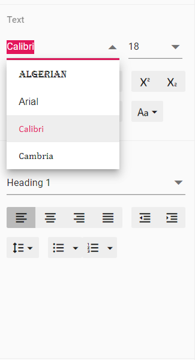

# How to customize the font family dropdown in Document Editor

Document editor provides options to customize the font family drop down list values using `fontFamilies` in Document editor settings. Fonts which are added in `fontFamilies` of `documentEditorSettings` will be displayed on font drop down list of text properties pane and font dialog.

Similarly, you can use `documentEditorSettings` property for DocumentEditor also.










