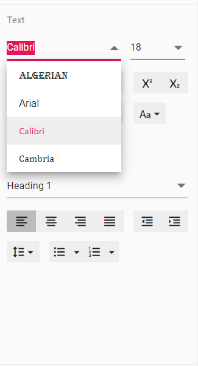

# How to Customize Font Family in ASP.NET Core DOCX Editor

[ASP.NET Core DOCX Editor](https://www.syncfusion.com/docx-editor-sdk/asp-net-core-docx-editor) (Document Editor) provides options to customize the font family dropdown list using `fontFamilies` in `DocumentEditorSettings`. Fonts that are added in `fontFamilies` of `documentEditorSettings` will be displayed on the font dropdown list of the Text Properties pane and the Font dialog.

Similarly, you can use the `documentEditorSettings` property for the DOCX Editor as well.










