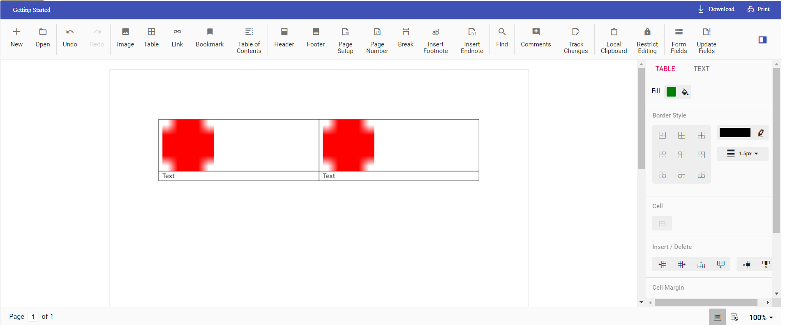

# How to Insert Text or Image in Table in ASP.NET Core DOCX Editor

Using the [ASP.NET Core DOCX Editor](https://www.syncfusion.com/docx-editor-sdk/asp-net-core-docx-editor) (Document Editor) APIs, you can insert [`text`] or [`image`] in a [`table`] programmatically based on your requirement.

Use the [`selection`] APIs to navigate between rows and cells.

The following example illustrates how to create a 2x2 table and then add text and an image programmatically.









The output will be as shown below.

