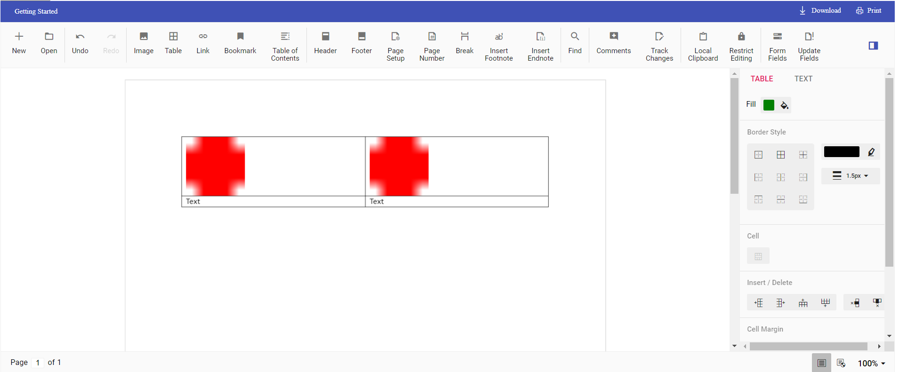

# How to insert text or image in table programmatically in  Document Editor component

Using Document editor API's, you can insert [`text`] or [`image`] in [`table`] programmatically based on your requirement.

Use [`selection`] API's to navigate between rows and cells.

The following example illustrates how to create 2*2 table and then add text and image programmatically.








The output will be like below.

