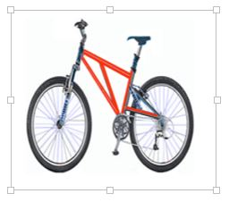

# Images in ASP.NET Core Document Editor

[ASP.NET Core Document Editor](https://www.syncfusion.com/docx-editor-sdk/asp-net-core-docx-editor) (Document Editor) supports common raster format images like PNG, BMP, JPEG, SVG and GIF. You can insert an image file or online image in the document using the `insertImage()` method. Refer to the following sample code.











Image files will be internally converted to base64 string. Whereas, online images are preserved as URL.

## Image resizing

Document Editor provides a built-in image resizer that can be injected into your application based on the requirements. This allows you to resize the image by dragging the resizing points using mouse or touch interactions. This resizer appears as follows.



## Changing size

Document Editor exposes an API to get or set the size of the selected image. Refer to the following sample code.

```typescript
documenteditor.selection.imageFormat.width = 800;
documenteditor.selection.imageFormat.height = 800;
```

N> Images are stored and processed (read/write) as a base64 string in Document Editor. The online image URL is preserved as a URL in Document Editor upon saving.

## Text wrapping style

Text wrapping refers to how images fit with surrounding text in a document. Please [refer to this page](./text-wrapping-style) for more information about text wrapping styles available in Word documents.

## Positioning the image

Document Editor preserves the position properties of the image and displays the image based on those position properties. It does not support modifying the position properties. Whereas, the image will be automatically moved along with the text being edited if it is positioned relative to the line or paragraph.

## See Also

* [Feature modules](./feature-module)
