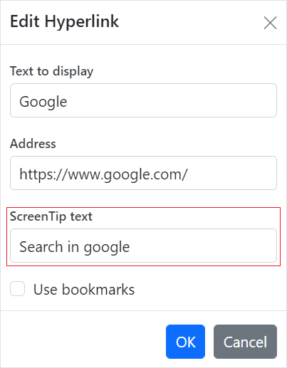

# Hyperlink in ASP.NET Core Document Editor

[ASP.NET Core DOCX Editor](https://www.syncfusion.com/docx-editor-sdk/asp-net-core-docx-editor) (Document Editor) supports hyperlink field. You can link a part of the document content to the Internet or a file location, a mail address, or any text within the document.

## Navigate a hyperlink

Document Editor triggers `requestNavigate` event whenever the user clicks the Ctrl key or taps a hyperlink within the document. This event provides necessary details about link type, navigation URL, and local URL (if any) as arguments, and allows you to easily customize the hyperlink navigation functionality.

### Add the requestNavigate event for DocumentEditor

The following example illustrates how to add requestNavigate event for DocumentEditor.












### Add the requestNavigate event for DocumentEditorContainer component

The following example illustrates how to add requestNavigate event for DocumentEditorContainer component.












If the selection is in a hyperlink, trigger this event by calling `navigateHyperlink` method of `Selection` instance.

```typescript
documenteditor.selection.navigateHyperlink();
```

## Copy link

Document Editor copies link text of a hyperlink field to the clipboard if the selection is in a hyperlink.

```typescript
documenteditor.selection.copyHyperlink();
```

## Add hyperlink

To create a basic hyperlink in the document, press `ENTER` / `SPACEBAR` / `SHIFT + ENTER` / `TAB` key after typing the address, for instance `http://www.google.com`. Document Editor automatically converts this address to a hyperlink field. The text can be considered as a valid URL if it starts with any of the following.

N> `<http://>`
N> `<https://>`
N> `file:///`
N> `www.`
N> `mailto:`












## Customize screen tip

You can customize the screen tip text for the hyperlink by using the sample code below.

```typescript
documenteditor.insertHyperlink('https://www.google.com', 'Google', '<<Screen tip text>>');
```

Screen tip text can be modified through UI by using the [Hyperlink dialog](../asp-net-core/dialog#hyperlink-dialog).



## Remove hyperlink

To remove the link from a hyperlink in the document, press Backspace key at the end of a hyperlink. By removing the link, it will be converted into plain text. You can use `removeHyperlink` method of `Editor` instance if the selection is in a hyperlink.

```typescript
documenteditor.editor.removeHyperlink();
```

## Hyperlink dialog

Document Editor provides dialog support to insert or edit a hyperlink.












You can use the following keyboard shortcut to open the hyperlink dialog if the selection is in a hyperlink.

| Key Combination | Description |
|-----------------|-------------|
|Ctrl + K | Opens the hyperlink dialog that allows you to create or edit a hyperlink.|

## Online Demo

Explore how to insert and manage hyperlinks in Word documents using the ASP.NET Core Document Editor in this live demo [here](https://document.syncfusion.com/demos/docx-editor/asp-net-core/documenteditor/hyperlinksandbookmarks#/tailwind3).

## See Also

* [Feature modules](../asp-net-core/feature-module)
* [Hyperlink dialog](../asp-net-core/dialog#hyperlink-dialog)
