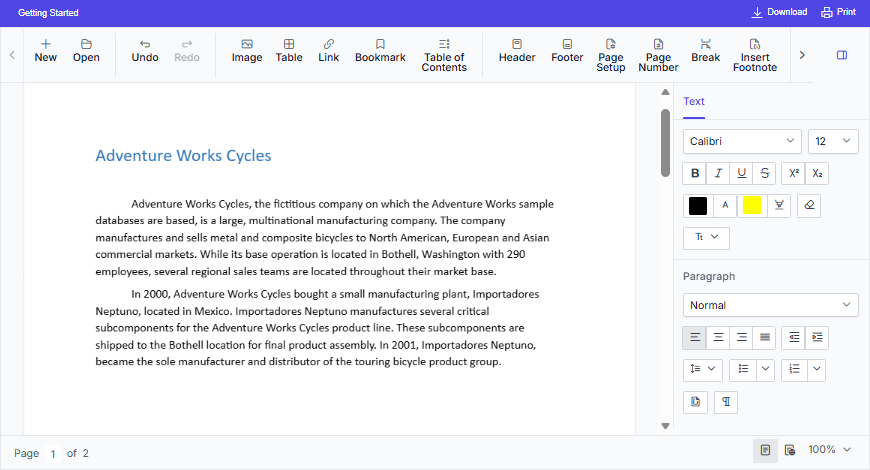

# Overview of the ASP.NET Core Document Editor

The [ASP.NET Core DOCX Editor](https://www.syncfusion.com/docx-editor-sdk/asp-net-core-docx-editor) (Document Editor) is a feature-rich, user-interactive component that enables creating, editing, viewing, and printing Word documents with advanced formatting, editing capabilities, and broad support for document import and export formats.

## Key Features

* [Opens](./import) native `Syncfusion Document Text (*.sfdt)` format documents on the client side.
* [Saves the documents](./export) on the client side as `Syncfusion Document Text (*.sfdt)` and `Word document (*.docx)`.
* Supports document elements like text, [image](./image), [table](./table), fields, [bookmark](./bookmark), [shapes](./shapes), [section](./section-format), [header and footer](./header-footer).
* Supports the commonly used fields like [hyperlink](./link), page number, page count, and table of contents.
* Supports formats like [text](./text-format), [paragraph](./paragraph-format), [bullets and numbering](./list-format), [table](./table-format), and [page settings](./section-format).
* Supports creating, editing, and applying [paragraph and character styles](./styles).
* Supports [find and replace](./find-and-replace) text within the document.
* Supports all the common editing and formatting operations along with [undo and redo](./history).
* Supports [cut](./clipboard#cut), [copy](./clipboard#copy), and [paste](./clipboard#paste) of rich text content within the component. Also supports pasting plain text to and from other applications.
* Supports inserting and editing [form fields](./form-fields).
* Supports inserting and editing [comments](./comments).
* Supports tracking [inserted and deleted content](./track-changes).
* Supports [spell checking](./spell-check) for any input text.
* Allows user interactions like [zoom](./scrolling-zooming#zooming), [scroll](./scrolling-zooming), and selecting contents through touch, mouse, and keyboard.
* Provides intuitive UI options like context menu, [dialogs](./dialog), and [navigation pane](./find-and-replace#options-pane).
* Provides a [ribbon interface](./ribbon) similar to Microsoft Word, with tab-based commands for quick and intuitive access to features.
* [Localizes](./global-local) all the static text to any desired language.
* Allows creating a lightweight Word viewer using module injection to view and [print](./print) Word documents.