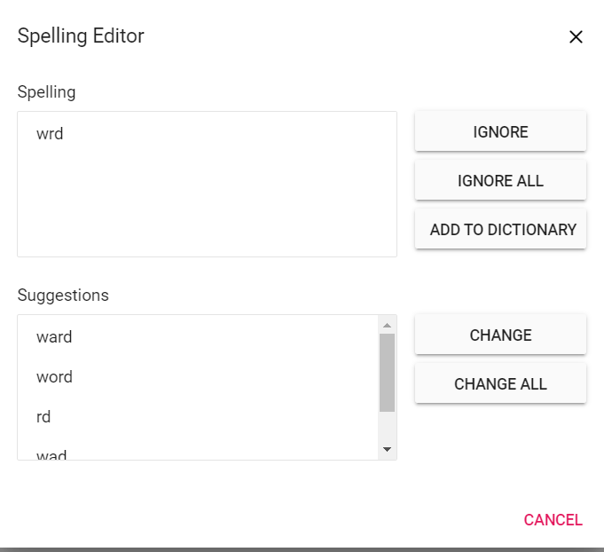

# Spell Check in ASP.NET Core DOCX Editor

[ASP.NET Core DOCX Editor](https://www.syncfusion.com/docx-editor-sdk/asp-net-core-docx-editor) (Document Editor) supports performing spell checking for any input text. Spell check is supported on the input text in the DOCX Editor and provides suggestions for misspelled words through the dialog and the context menu.









## Features

* Supports context menu suggestions.
* Provides built-in options to Ignore, Ignore All, Change, Change All for error words in the spell checker dialog.

## Enable spellCheck

To enable spell check in the DOCX Editor, set `enableSpellCheck` to `true` and configure `SpellCheckSettings`.

## Disable spellCheck

To disable spell check in the DOCX Editor, set `enableSpellCheck` to `false` or remove the `enableSpellCheck` property initialization code. The default value of this property is false.

## Spell check settings

### Disable underline

By default, misspelled words are marked with a squiggly line. You can disable this behavior by enabling the `removeUnderline` API so that no squiggly line is rendered for misspelled words.

```typescript
this.container.documentEditor.spellChecker.removeUnderline = true;
```

### AllowSpellCheckAndSuggestion

By default, when you perform a spell check in the DOCX Editor, both the spelling and suggestions for misspelled words are retrieved, and the words can be corrected through the context menu suggestions. You can modify this behavior using the `allowSpellCheckAndSuggestion` API, which performs only the spell check.

```typescript
this.container.documentEditor.spellChecker.allowSpellCheckAndSuggestion = false;
```

### LanguageID

The DOCX Editor supports multi-language spell check. You can add as many languages (dictionaries) on the server side; to use a language for spell checking in the DOCX Editor, it must match the `languageID` you pass to the DOCX Editor.

```typescript
this.container.documentEditor.spellChecker.languageID = 1033; //LCID of "en-us";
```

### EnableOptimizedSpellCheck

The DOCX Editor provides an option to spellcheck page by page when loading the documents. The default value of this property is false, so when opening the document spellcheck web API will be called for each word in the document. To optimize the frequency of spellcheck web API calls, you can enable this property.

```typescript
this.container.documentEditor.spellChecker.enableOptimizedSpellCheck = true;
```

### Spell check dictionary cache

Starting from `v20.1.0.xx`, the performance and memory usage of the spell checker have been optimized by adding a static method to initialize the dictionaries with a specified cache count.

By default, the spell checker holds only one language dictionary in memory. If you want to hold multiple dictionaries in memory, set the cache limit using the `InitializeDictionaries` method as in the following example.

```csharp
 List<DictionaryData> spellDictCollection = new List<DictionaryData>();
 string personalDictPath = string.Empty;
 int cacheCount = 2;
 // Initialize dictionaries
 SpellChecker.InitializeDictionaries(spellDictCollection, personalDictPath, cacheCount);
```

If dictionaries are initialized using the `InitializeDictionaries` method, the default `SpellChecker` constructor should be used to check spelling and get suggestions, as in the following example. This prevents reinitialization of already loaded dictionaries.

```csharp
public string SpellCheck([FromBody] SpellCheckJsonData spellChecker)
{
      try
      {
            SpellChecker spellCheck = new SpellChecker();
            spellCheck.GetSuggestions(spellChecker.LanguageID, spellChecker.TexttoCheck, spellChecker.CheckSpelling, spellChecker.CheckSuggestion, spellChecker.AddWord);
            return Newtonsoft.Json.JsonConvert.SerializeObject(spellCheck);
      }
      catch
      {
            return "{\"SpellCollection\":[],\"HasSpellingError\":false,\"Suggestions\":null}";
      }
}
```

Previously on every `SpellChecker.GetSuggestion()` method call, the `.aff` and dictionary data will be parsed to generate a suggestion for a misspelled word. But, starting from `v20.1.0.xx`, the `.aff` and dictionary data will be parsed only the first time while calling the `SpellChecker.GetSuggestion()` method.

### Add new root word and possible words to dictionary

If you find a root word missing in the dictionary file, then you can add that new root word and the rule to form the possible words to the dictionary file using the `AddNewWord` API in the server-side Spell check library.

N>1. The rules are framed automatically using the root word, the possible words and affix file.
<br/>2. If you pass null for the parameters `affPath` and `possibleWords`, then it will add a single root word to dictionary.
<br/>3. This API is included starting from `v20.2.0.xx`.

The following code example demonstrates how to add a new root word to the dictionary along with the rule to form the possible words.

```csharp
SpellChecker spellChecker = new SpellChecker();
// Adds the specified new root word to the dictionary along with the rule to form the possible words.
spellChecker.AddNewWord("en.dic","en.aff", "construct", new string[] { "constructs", "reconstruct", "constructed", "constructive" });
```

## Context menu

Right-click on an error word to open the context menu with spell check options.


### Suggestions

Context menu shows the suggestions for misspelled words. Clicking a suggestion replaces the error word automatically.

### Add to dictionary

Use this option to add the current word to the dictionary so that the spell checker does not consider it an error in the future.

### Ignore once and ignore all

If you do not wish to add the word to the dictionary and do not want to show an error, use Ignore Once or Ignore All options.

Ignore: ignores only the current occurrence of a word from the error.

Ignore All: ignores all occurrences of a word from the error in the entire document.

### Spelling

Using this option, you can open the spell check dialog.



* Refer to the [Spell checker](https://github.com/SyncfusionExamples/EJ2-Document-Editor-Web-Services/tree/master/ASP.NET%20Core#steps-to-configure-spell-checker) link for configuring the spell checker on the server side.