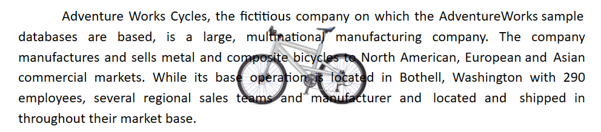

# Text wrapping style in Document Editor

Text wrapping refers to how images and shapes are placed within the surrounding text in a document. Currently, the [ASP.NET Core DOCX Editor](https://www.syncfusion.com/docx-editor-sdk/asp-net-core-docx-editor) (Document Editor) has only preservation support for images and textbox shapes with the following wrapping styles.

## In line with text

In this option, the image or shape is placed on the same line and surrounded by text like any other word or letter. This image or shape will be automatically moved along with the text while editing; the other options keep the image or shape in a fixed position while the text shifts and wraps around it.

## In front of text

In this option, the image or shape is placed in front of the text. This can be used to place an image over some text or to add a shape to highlight part of a paragraph.

N> Starting from v18.2.0.x, the in front of text wrapping styles are supported.

## Top and bottom

In this option, text wraps above and below the image or shape. No text is to the left or right of the image or shape. This can be used for larger images or shapes that occupy most of the width of a document.

N> Starting from v19.1.0.x, the top and bottom wrapping style is supported.

## Behind

In this option, the image or shape is placed behind the text. This can be used when you need to add a watermark or background image to a document.

N> Starting from v19.2.0.x, behind text wrapping styles are supported.

## Square

In this option, text wraps around the image or text box in a square shape.

N> `Tight` and `Through` styles will be preserved as the `Square` wrapping style in the Document Editor, which is supported from v19.2.0.x.

