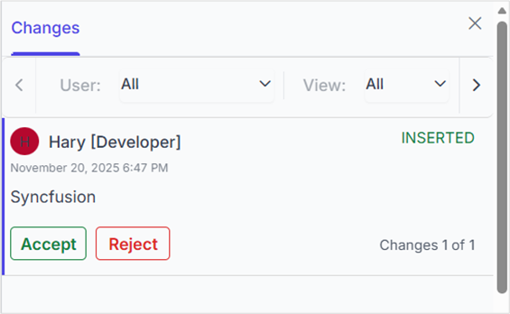

# Track Changes in ASP.NET Core Document Editor Component

Track Changes allows you to keep a record of changes or edits made to a document. You can then choose to accept or reject the modifications. It is a useful tool for managing changes made by several reviewers to the same document. If the track changes option is enabled, all editing operations are preserved as revisions in the Document Editor.

## Enable track changes in Document Editor

The following example demonstrates how to enable track changes.












N> Track changes are document-level settings. When opening a document, if the document does not have track changes enabled, then `enableTrackChanges` will be disabled even if `enableTrackChanges = true` is set in the initial rendering. To enable track changes for all documents, we recommend enabling track changes during the document change event. The following example demonstrates how to enable Track changes for all documents while opening.












## Show or hide revisions pane

This feature lets users toggle the visibility of the revisions pane, providing flexibility in managing tracked changes within the document.

The following example code illustrates how to show or hide the revisions pane.












## Get all tracked revisions

The following example demonstrates how to get all tracked revisions from the current document.

```typescript
/**
 * Get revisions from the current document
 */
var revisions  = container.documentEditor.revisions;
```

## Accept or Reject all changes programmatically

The following example demonstrates how to accept/reject all changes.

```typescript
/**
 * Get revisions from the current document
 */
var revisions = container.documentEditor.revisions;

/**
 * Accept all tracked changes
 */
revisions.acceptAll();

/**
 * Reject all tracked changes
 */
revisions.rejectAll();
```

## Accept or reject a specific revision

The following example demonstrates how to accept or reject a specific revision in the Document Editor.

```typescript
/**
 * Get revisions from the current document
 */
var revisions  = container.documentEditor.revisions;
/**
 * Accept specific changes
 */
revisions.get(0).accept();
/**
 * Reject specific changes
 */
revisions.get(1).reject();
```

## Navigate between the tracked changes

The following example demonstrates how to navigate tracked revisions programmatically.

```typescript
/**
 * Navigate to next tracked change from the current selection.
 */
container.documentEditor.selection.navigateNextRevision();

/**
 * Navigate to previous tracked change from the current selection.
 */
container.documentEditor.selection.navigatePreviousRevision();
```

## Filtering changes based on user

In DocumentEditor, we have built-in review panel in which we have provided support for filtering changes based on the user.


## Custom metadata along with author

The Document Editor provides options to customize revisions using `revisionSettings`. The `customData` property allows you to attach additional metadata to tracked revisions in the Word Processor. This metadata can represent roles, tags, or any custom identifier for the revision. To display this metadata along with the author name in the Track Changes pane, you must enable the `showCustomDataWithAuthor` property.

The following example code illustrates how to enable and update custom metadata for track changes revisions.










The Track Changes pane will display the author name along with the custom metadata, as shown in the screenshot below.



N> When you export the document as SFDT, the `customData` value is stored in the revision collection. When you reopen the SFDT, the custom data is automatically restored and displayed in the Track Changes pane. For other formats such as DOCX, the `customData` is not preserved, as it is specific to the Document Editor component.

## Protect the document in track changes only mode

Document Editor provides support for protecting the document with `RevisionsOnly` protection. In this protection, all the users are allowed to view the document and do their corrections, but they cannot accept or reject any tracked changes in the document. Later, the author can view their corrections and accept or reject the changes.

The Document Editor provides an option to protect and unprotect the document using the `enforceProtection` and `stopProtection` APIs.

The following example code illustrates how to enforce and stop protection in the Document Editor container.












Tracked changes only protection can be enabled in UI by using [Restrict Editing pane](https://ej2.syncfusion.com/aspnetcore/documentation/document-editor/document-management#restrict-editing-pane)


N> In the `EnforceProtection` method, the first parameter is the password and the second parameter is the protection type. Possible values of protection type are `NoProtection | ReadOnly | FormFieldsOnly | CommentsOnly | RevisionsOnly`. In the `StopProtection` method, the parameter is the password.

## Online demo

Explore how to track and review changes in Word documents using the ASP.NET Core Document Editor in this [live demo](https://document.syncfusion.com/demos/docx-editor/asp-net-core/documenteditor/trackchanges#/tailwind3).