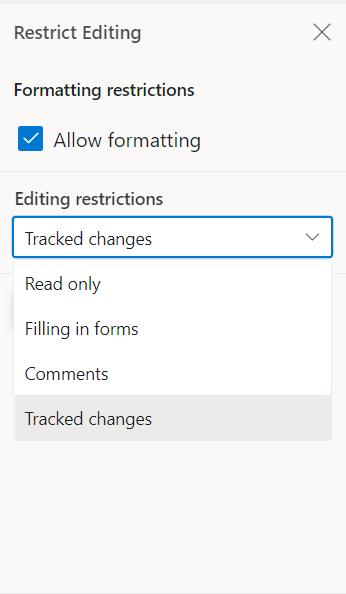

# Track Changes in Document Editor Component

Track Changes allows you to keep a record of changes or edits made to a document. You can then choose to accept or reject the modifications. It is a useful tool for managing changes made by several reviewers to the same document. If track changes option is enabled, all editing operations are preserved as revisions in Document Editor.

## Enable track changes in Document Editor

The following example demonstrates how to enable track changes.
























>Track changes are document level settings. When opening a document, if the document does not have track changes enabled, then enableTrackChanges will be disabled even if we set enableTrackChanges = true in the initial rendering. If you want to enable track changes for all the documents, then we recommend enabling track changes during the document change event. The following example demonstrates how to enable Track changes for the all the Document while Opening.























## Show/Hide Revisions Pane
 
The Show/Hide Revisions Pane feature in the Document Editor allows users to toggle the visibility of the revisions pane, providing flexibility in managing tracked changes within the document.
 
The following example code illustrates how to show/hide the revisions pane.
























## Get all tracked revisions

The following example demonstrate how to get all tracked revision from current document.

```typescript
/**
 * Get revisions from the current document
 */
var revisions  = container.documentEditor.revisions;
```

## Accept or Reject all changes programmatically

The following example demonstrates how to accept/reject all changes.

```typescript
/**
 * Get revisions from the current document
 */
var revisions = container.documentEditor.revisions;

/**
 * Accept all tracked changes
 */
revisions.acceptAll();

/**
 * Reject all tracked changes
 */
revisions.rejectAll();
```

## Accept or reject a specific revision

The following example demonstrates how to accept/reject specific revision in the Document Editor.

```typescript
/**
 * Get revisions from the current document
 */
var revisions  = container.documentEditor.revisions;
/**
 * Accept specific changes
 */
revisions.get(0).accept();
/**
 * Reject specific changes
 */
revisions.get(1).reject();
```

## Navigate between the tracked changes

The following example demonstrates how to navigate tracked revision programmatically.

```typescript
/**
 * Navigate to next tracked change from the current selection.
 */
container.documentEditor.selection.navigateNextRevision();

/**
 * Navigate to previous tracked change from the current selection.
 */
container.documentEditor.selection.navigatePreviousRevision();
```

## Filtering changes based on user

In DocumentEditor, we have built-in review panel in which we have provided support for filtering changes based on the user.


## Protect the document in track changes only mode

Document Editor provides support for protecting the document with `RevisionsOnly` protection. In this protection, all the users are allowed to view the document and do their corrections, but they cannot accept or reject any tracked changes in the document. Later, the author can view their corrections and accept or reject the changes.

Document editor provides an option to protect and unprotect document using `enforceProtection` and `stopProtection` API.

The following example code illustrates how to enforce and stop protection in Document editor container.
























Tracked changes only protection can be enabled in UI by using [Restrict Editing pane](../document-editor/document-management#restrict-editing-pane/)



N> In enforce Protection method, first parameter denotes password and second parameter denotes protection type. Possible values of protection type are `NoProtection |ReadOnly |FormFieldsOnly |CommentsOnly |RevisionsOnly`. In stop protection method, parameter denotes the password.