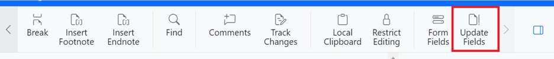

# Fields in ASP.NET MVC Document Editor

[ASP.NET MVC DOCX Editor](https://www.syncfusion.com/docx-editor-sdk/asp-net-mvc-docx-editor) (Document Editor) has preservation support for all types of fields in an existing Word document without any data loss.

## Adding Fields

You can add a field to the document by using the [`insertField`](https://ej2.syncfusion.com/documentation/api/document-editor/editor#insertfield) method in the `Editor` module.

```typescript

var fieldCode = 'MERGEFIELD  First Name  \\* MERGEFORMAT ';
var fieldResult = '«First Name»';
documenteditor.editor.insertField(fieldCode, fieldResult);

```

N> Document Editor does not validate or process the field code or field result. It simply inserts the field with the specified field information.

## Update fields

Document Editor provides support for updating bookmark cross reference fields.

```typescript
//Update all the bookmark cross reference fields in the document.
documenteditor.updateFields();
```

Bookmark cross reference fields can be updated through the UI by using the update fields option in `Toolbar`.



The following types of fields are automatically updated in Document Editor.

* NUMPAGES
* SECTION
* PAGE

## Get field info

You can get the field code and field result of the currently selected field by using the [`getFieldInfo`](https://ej2.syncfusion.com/documentation/api/document-editor/selection#getfieldinfo) method in the `Selection` module.

```typescript
//Gets the field information of the selected field.
var fieldInfo = documenteditor.selection.getFieldInfo();
```

N> For nested fields, this method returns the combined field code and result.

## Set field info

You can modify the field code and field result of the currently selected field by using the [`setFieldInfo`](https://ej2.syncfusion.com/documentation/api/document-editor/editor#setfieldinfo) method in the `Editor` module.

```typescript
//Get the field information for the selected field.
var fieldInfo = documenteditor.selection.getFieldInfo();

//Modify field code
fieldInfo.code = 'MERGEFIELD  First Name  \\* MERGEFORMAT ';

//Modify field result
fieldInfo.result = '«First Name»';

//Modify field code and result of the currently selected field.
documenteditor.editor.setFieldInfo(fieldInfo);
```

N> For a nested field, the entire field is replaced completely with the specified field information.

## See Also

[Mail merge using DocIO](https://help.syncfusion.com/file-formats/docio/working-with-mail-merge)
[Mail merge demo](https://github.com/SyncfusionExamples/EJ2-Document-Editor-Web-Services/blob/master/ASP.NET%20Core/src/Controllers/DocumentEditorController.cs#L114)