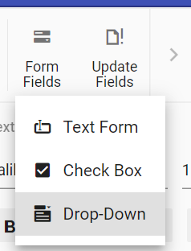

# Form Fields in ASP.NET MVC in Document Editor Control

DocumentEditorContainer control provides support for inserting Text, CheckBox, DropDown form fields through in-built toolbar.



## Insert form field

Form fields can be inserted using `insertFormField` method in editor module.

```typescript
//Insert Text form field
documentEditor.editor.insertFormField('Text');
//Insert Checkbox form field
documentEditor.editor.insertFormField('CheckBox');
//Insert Drop down form field
documentEditor.editor.insertFormField('Dropdown');
```

## Get form field names

All the form fields names from current document can be retrieved using `getFormFieldNames()`.

```typescript
var formFieldsNames = documentEditor.getFormFieldNames();
```

## Get form field properties

Form field properties can be retrieved using `getFormFieldInfo()`.

```typescript
//Text form field
var textfieldInfo = documentEditor.getFormFieldInfo('Text1');
//Checkbox form field
var checkboxfieldInfo = documentEditor.getFormFieldInfo('Check1');
//Dropdown form field
var dropdownfieldInfo = documentEditor.getFormFieldInfo('Drop1');
```

## Set form field properties

Form field properties can be modified using `setFormFieldInfo`.

```typescript
// Set text form field properties
var textfieldInfo = documentEditor.getFormFieldInfo('Text1');
textfieldInfo.defaultValue = "Hello";
textfieldInfo.format = "Uppercase";
textfieldInfo.type = "Text";
documentEditor.setFormFieldInfo('Text1',textfieldInfo);

// Set checkbox form field properties
var checkboxfieldInfo = documentEditor.getFormFieldInfo('Check1');
checkboxfieldInfo.defaultValue = true;
documentEditor.setFormFieldInfo('Check1',checkboxfieldInfo);

// Set checkbox form field properties
var dropdownfieldInfo = documentEditor.getFormFieldInfo('Drop1');
dropdownfieldInfo.dropDownItems = ['One','Two', 'Three']
documentEditor.setFormFieldInfo('Drop1',dropdownfieldInfo);
```

## Export form field data

Data of the all Form fields in the document can be exported using `exportFormData`.

```typescript
var formFieldDate = documentEditor.exportFormData();
```

## Import form field data

Form fields can be prefilled with data using `importFormData`.

```typescript
var textformField = {fieldName: 'Text1', value: 'Hello World'};
var checkformField = {fieldName: 'Check1', value: true};
var dropdownformField = {fieldName: 'Drop1', value: 1};
//Import form field data
documentEditor.importFormData([textformField,checkformField,dropdownformField]);
```

## Reset form fields

Reset all the form fields in current document to default value using `resetFormFields`.

```typescript
documentEditor.resetFormFields();
```

## Protect the document in form filling mode

Document Editor provides support for protecting the document with `FormFieldsOnly` protection. In this protection, user can only fill form fields in the document.

Document editor provides an option to protect and unprotect document using `enforceProtection` and `stopProtection` API.










N> In enforce Protection method, first parameter denotes password and second parameter denotes protection type. Possible values of protection type are `NoProtection |ReadOnly |FormFieldsOnly |CommentsOnly`. In stop protection method, parameter denotes the password.