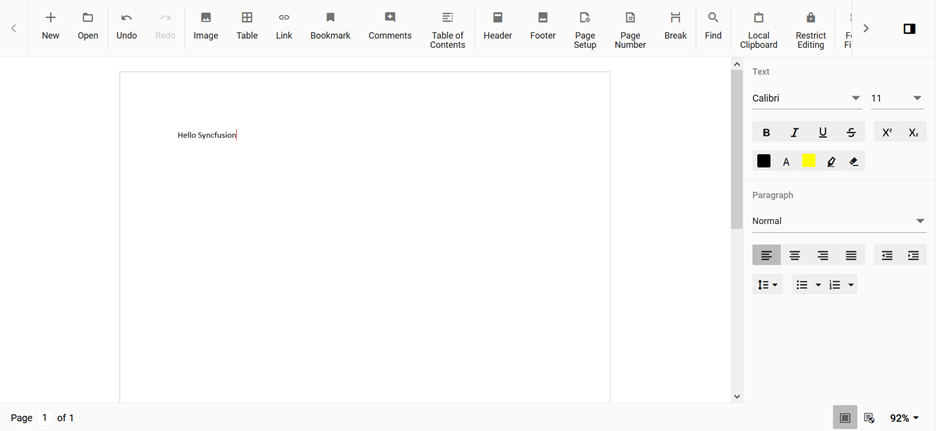

# How to change cursor color in ASP.NET MVC Document Editor component

The Document Editor default cursor color is black. The user can change the color by overriding the CSS property using the class name. The Document Editor cursor CSS has a class named `e-de-blink-cursor`.

Add the following CSS to change the cursor color to red.

```css
.e-de-blink-cursor {
    border-left: 1px solid red !important;
}
```

The output is shown below:


