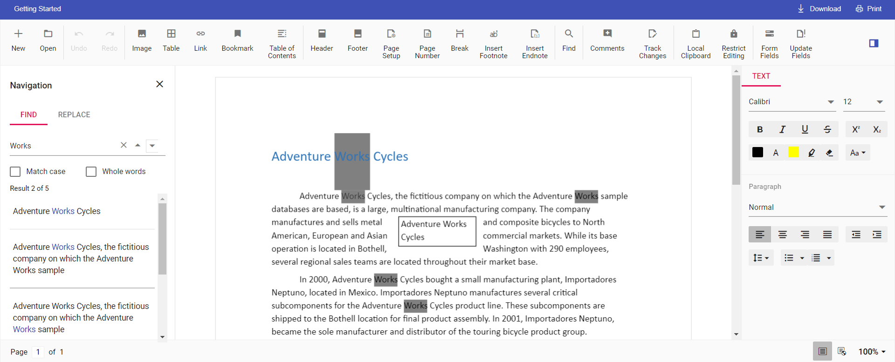

# How to change the default search highlight color in ASP.NET MVC DOCX Editor component

DOCX Editor provides an option to change the default search highlight color using `searchHighlightColor` in DOCX Editor settings. The highlight color specified in [`documentEditorSettings`](https://help.syncfusion.com/cr/aspnetcore-js2/Syncfusion.EJ2.DocumentEditor.DocumentEditorContainer.html#Syncfusion_EJ2_DocumentEditor_DocumentEditorContainer_DocumentEditorSettings) is applied to the searched text. By default, the search highlight color is `yellow`.

Similarly, you can use the `documentEditorSettings` property with the DocumentEditor control as well.

The following example code illustrates how to change the default search highlight color.








Output will be like below:

