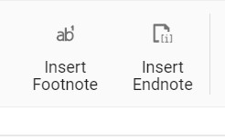
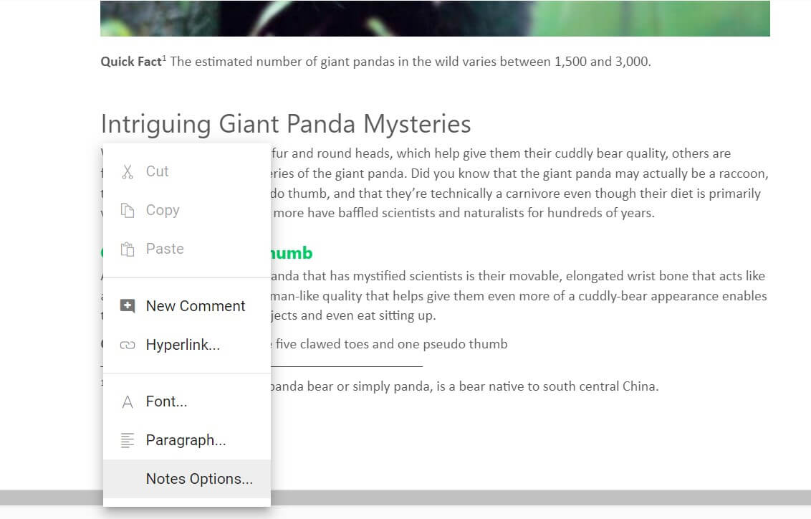

# Footnotes and Endnotes in ASP.NET MVC DOCX Editor

The DocumentEditorContainer component provides support for inserting footnotes and endnotes through the in-built toolbar. The DocumentEditor also exposes APIs to insert footnotes and endnotes programmatically.

Footnotes and endnotes are both ways of adding extra bits of information to your writing outside of the main text. You can use footnotes and endnotes to add side comments to your work or to cite other publications such as books, articles, or websites.

## Insert footnotes

The DOCX Editor exposes an API to insert footnotes at the cursor position programmatically, or at the end of the currently selected text.










## Insert endnotes

The DOCX Editor exposes an API to insert endnotes at the cursor position programmatically, or at the end of the currently selected text.










## Update or edit footnotes and endnotes

You can update or edit footnotes and endnotes using the built-in context menu that appears when you right-click them. The Footnote/Endnote dialog box pops up, where you can customize the number format and the "Start at" value.

## Online Demo

Explore how to add and manage notes in Word documents using the ASP.NET MVC DOCX Editor in this live demo [here](https://document.syncfusion.com/demos/docx-editor/asp-net-mvc/documenteditor/notes#/tailwind3).
