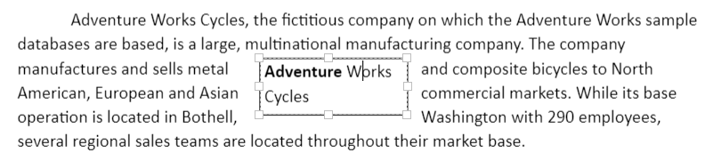

# Shapes in ASP.NET MVC Document Editor

Shapes are drawing objects that include text boxes, rectangles, lines, curves, circles, and so on. They can be preset or custom geometry. The Document Editor does not currently support inserting shapes. However, if the imported document contains a shape, the shape is preserved.

## Supported shapes

The Document Editor has preservation support for lines, rectangles, basic shapes, block arrows, equation shapes, flowchart shapes, and stars and banners.

N> When using the ASP.NET MVC service, the unsupported shapes are converted into images and preserved as images.

## Text Box Shape

A text box is a rectangular area on the document where you can enter text. When you click in a text box, a flashing cursor displays, indicating that you can begin typing. It supports multiple lines of text with all text formatting.

## Shape Resizer

The Document Editor also supports a built-in shape resizer to resize the shapes present in the document. The shape resizer accepts both touch and mouse interactions.

## Text wrapping style

Text wrapping refers to how shapes fit with surrounding text in a document. [Refer to this page](./text-wrapping-style) for more information about text wrapping styles available in Word documents.

## Positioning the shape

The Document Editor preserves the position properties of shapes and displays them based on those properties. It does not support modifying the position properties. However, a shape positioned relative to a line or paragraph moves automatically when the surrounding text is edited.

## Online Demo

Explore how to preserve AutoShapes and grouped shapes in Word documents using the ASP.NET MVC DOCX Editor in this live demo [here](https://document.syncfusion.com/demos/docx-editor/asp-net-mvc/documenteditor/autoshapes#/tailwind3).