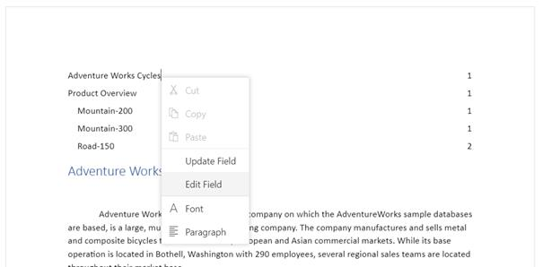

# Table of Contents in ASP.NET MVC DOCX Editor

The table of contents in a document is the same as the list of chapters at the beginning of a book. It lists each heading in the document and the page number where that heading starts, with various options to customize the appearance.

## Inserting table of contents

Document Editor exposes an API to insert a table of contents at the cursor position programmatically. You can specify the settings for the table of contents explicitly. Otherwise, the default settings will be applied.

`TableOfContentsSettings` contains the following properties:
* **startLevel**: Specifies the start level for constructing table of contents.
* **endLevel**: Specifies the end level for constructing table of contents.
* **includeHyperlink**: Specifies whether the link for headings is included.
* **includePageNumber**: Specifies whether the page number of the headings is included.
* **rightAlign**: Specifies whether the page number is right aligned.
* **tabLeader**: Specifies the tab leader styles such as none, dot, hyphen, and underscore.
* **includeOutlineLevels**: Specifies whether the outline levels are included.

```javascript
var tocSettings=
{
    startLevel: 1, endLevel: 3, includeHyperlink: true, includePageNumber: true, rightAlign: true
};
documenteditor.editor.insertTableOfContents(tocSettings);
```











## Update or edit table of contents

You can update or edit the table of contents using the built-in context menu shown by right-clicking it.



* **Update Field**: Updates the headings in the table of contents with the same settings by searching the entire document.
* **Edit Field**: Opens the built-in table of contents dialog and allows modifying its settings.

You can also do it programmatically by using the exposed API.

```typescript
documenteditor.open(''); /*Open any existing document*/
var tocSettings  =
{
    startLevel: 1, endLevel: 3, includeHyperlink: true, includePageNumber: true, rightAlign: true
};
documenteditor.editorModule.insertTableOfContents(tocSettings);

```

N> Same method is used for inserting, updating, and editing table of contents. This will work based on the current element at the cursor position and the optional settings parameter. If table of contents is present at the cursor position, the update operation will be done based on the optional settings parameter. Otherwise, the insert operation will be done.

## Online demo

Explore how to insert and update table of contents in Word documents using the ASP.NET MVC Document Editor in this live demo [here](https://document.syncfusion.com/demos/docx-editor/asp-net-mvc/documenteditor/tableofcontents#/tailwind3).

## See also

* [Table of contents dialog](./dialog#table-of-contents-dialog)
