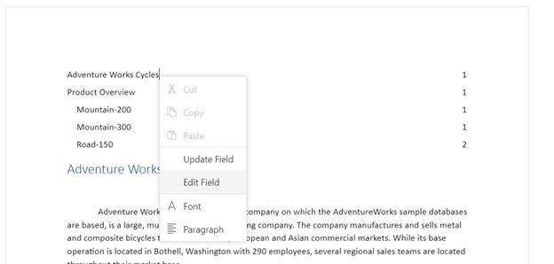

# Table of contents

The table of contents in a document is same as the list of chapters at the beginning of a book. It lists each heading in the document and the page number, where that heading starts with various options to customize the appearance.

## Inserting table of contents

Document editor exposes an API to insert table of contents at cursor position programmatically. You can specify the settings for table of contents explicitly. Otherwise, the default settings will be applied.

`TableOfContentsSettings` contain the following properties:
* **startLevel**: Specifies the start level for constructing table of contents.
* **endLevel**: Specifies the end level for constructing table of contents.
* **includeHyperlink**: Specifies whether the link for headings is included.
* **includePageNumber**: Specifies whether the page number of the headings is included.
* **rightAlign**: Specifies whether the page number is right aligned.
* **tabLeader**: Specifies the tab leader styles such as none, dot, hyphen, and underscore.
* **includeOutlineLevels**: Specifies whether the outline levels are included.

```javascript
var tocSettings=
{
    startLevel: 1, endLevel: 3, includeHyperlink: true, includePageNumber: true, rightAlign: true
};
documenteditor.editor.insertTableOfContents(tocSettings);
```










## Update or edit table of contents

You can update or edit the table of contents using the built-in context menu shown up by right-clicking it.



* **Update Field**: Updates the headings in table of contents with same settings by searching the entire document.
* **Edit Field**: Opens the built-in table of contents dialog and allows to modify its settings.

You can also do it programmatically by using the exposed API.

```typescript
documenteditor.open(''); /*Open any existing document*/
var tocSettings  =
{
    startLevel: 1, endLevel: 3, includeHyperlink: true, includePageNumber: true, rightAlign: true
};
documenteditor.editorModule.insertTableOfContents(tocSettings);

```

N>Same method is used for inserting, updating, and editing table of contents. This will work based on the current element at cursor position and the optional settings parameter. If table of contents is present at cursor position, the update operation will be done based on the optional settings parameter. Otherwise, the insert operation will be done.

## See Also

* [Table of contents dialog](./dialog#table-of-contents-dialog)
