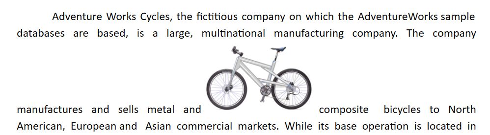

# Text Wrapping Style in Document Editor 

Text wrapping refers to how images and shapes are fitted with surrounding text in a document. Currently, Document Editor has only preservation support for image and text box shapes with the following wrapping styles.

## In-Line with text

In this option, the image or shape is placed on the same line surrounded by text like any other word or letter. This image or shape will be automatically moved along with the text while editing, whereas the other options mean that the image or shape stays in a fixed position while the text shifts and wraps around it.

## In front of text

In this option, the image or shape is placed in front of the text. This can be used to place an image around some text or to add a shape to highlight the part of a paragraph.

N> Starting from v18.2.0.x, the in-front-of wrapping styles are supported.

## Top and Bottom

In this option, text wraps above and below the image or shape. No text is to the left or right of the image or shape. This can be used for larger images or shapes that occupy most of the width in a document.

N> Starting from v19.1.0.x, the top and bottom wrapping style is supported.

## Behind

In this option, the image or shape is placed behind the text. This can be used when you need to add a watermark or background image to a document.

N> Starting from v19.2.0.x, behind text wrapping style is supported.

## Square

In this option, text wraps around the image or text box in a square shape.

N> Tight and Through styles will be preserved as the square wrapping style in Document Editor, which is supported from v19.2.0.x.

