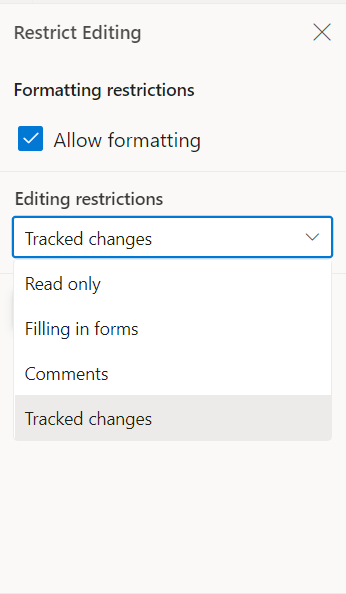

# Track Changes in ASP.NET MVC DOCX Editor

Track Changes allows you to keep a record of changes or edits made to a document. You can then choose to accept or reject the modifications. It is a useful tool for managing changes made by several reviewers to the same document. If the Track Changes option is enabled, all editing operations are preserved as revisions in the DOCX Editor.

## Enable track changes in DOCX Editor

The following example demonstrates how to enable Track Changes.











N> Track changes are document-level settings. When opening a document, if the document does not have track changes enabled, then `enableTrackChanges` will be disabled even if `enableTrackChanges = true` is set during the initial rendering. If you want to enable track changes for all documents, then enable track changes during the `documentChange` event. The following example demonstrates how to enable Track Changes for all documents while opening.










## Show/Hide revisions pane

The Show/Hide Revisions Pane feature in the DOCX Editor allows users to toggle the visibility of the revisions pane, providing flexibility in reviewing tracked changes in the document.
 
The following example code illustrates how to show/hide the revisions pane.










## Get all tracked revisions

The following example demonstrates how to get all tracked revisions from the current document.

```typescript
/**
 * Get revisions from the current document
 */
var revisions  = container.documentEditor.revisions;
```

## Accept or reject all changes programmatically

The following example demonstrates how to accept or reject all changes.

```typescript
/**
 * Get revisions from the current document
 */
var revisions = container.documentEditor.revisions;

/**
 * Accept all tracked changes
 */
revisions.acceptAll();

/**
 * Reject all tracked changes
 */
revisions.rejectAll();
```

## Accept or reject a specific revision

The following example demonstrates how to accept or reject a specific revision in the DOCX Editor.

```typescript
/**
 * Get revisions from the current document
 */
var revisions  = container.documentEditor.revisions;
/**
 * Accept specific changes
 */
revisions.get(0).accept();
/**
 * Reject specific changes
 */
revisions.get(1).reject();
```

## Navigate between the tracked changes

The following example demonstrates how to navigate tracked revisions programmatically.

```typescript
/**
 * Navigate to next tracked change from the current selection.
 */
container.documentEditor.selection.navigateNextRevision();

/**
 * Navigate to previous tracked change from the current selection.
 */
container.documentEditor.selection.navigatePreviousRevision();
```

## Filtering changes based on user

The DOCX Editor has a built-in review panel that supports filtering changes by user.


## Custom metadata along with author

The DOCX Editor provides a `revisionSettings` property to customize revisions. The `customData` property allows you to attach additional metadata to tracked revisions in the Word Processor. This metadata can represent roles, tags, or any custom identifier for the revision. To display this metadata along with the author name in the Track Changes pane, you must enable the `showCustomDataWithAuthor` property.

The following example code illustrates how to enable and update custom metadata for track changes revisions.










The Track Changes pane will display the author name along with the custom metadata, as shown in the screenshot below.


N> When you export the document as SFDT, the `customData` value is stored in the revision collection. When you reopen the SFDT, the custom data is restored automatically and displayed in the Track Changes pane. Other than SFDT export (e.g., DOCX and others), the `customData` is not preserved, as it is specific to the DOCX Editor component.

## Protect the document in track changes only mode

The DOCX Editor provides support for protecting the document with `RevisionsOnly` protection. In this protection, all users can view the document and make corrections, but they cannot accept or reject any tracked changes in the document. Later, the author can view their corrections and accept or reject the changes.

The DOCX Editor provides options to protect and unprotect a document using the `enforceProtection` and `stopProtection` APIs.

The following example code illustrates how to enforce and stop protection in the Document Editor container.










Tracked changes only protection can be enabled in UI by using [Restrict Editing pane](./document-management#restrict-editing-pane)



N> In the `enforceProtection` method, the first parameter denotes the password and the second parameter denotes the protection type. Possible values of the protection type are `NoProtection | ReadOnly | FormFieldsOnly | CommentsOnly | RevisionsOnly`. In the `stopProtection` method, the parameter denotes the password.
## Online demo

Explore how to track and review changes in Word documents using the ASP.NET MVC DOCX Editor in this [live demo](https://document.syncfusion.com/demos/docx-editor/asp-net-mvc/documenteditor/trackchanges#/tailwind3).
