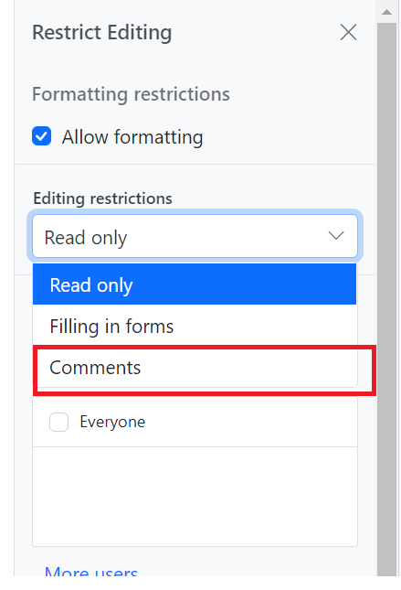

# Comments in Blazor DocumentEditor Component

The [Blazor Word Processor](https://www.syncfusion.com/blazor-components/blazor-word-processor) (Document Editor) provides comprehensive support for adding, navigating, and managing comments within a document. These features facilitate collaborative review and feedback cycles. Operations can be performed both through the built-in user interface and programmatically using APIs.

## Add a new comment

Using [`InsertCommentAsync`](https://help.syncfusion.com/cr/blazor/Syncfusion.Blazor.DocumentEditor.EditorModule.html#Syncfusion_Blazor_DocumentEditor_EditorModule_InsertCommentAsync_System_String_) method, comments can be inserted to the selected text.

```csharp
await container.DocumentEditor.Editor.InsertCommentAsync("Test comment");
```

## Comment navigation

Next and previous comments can be navigated using the below code snippet.

```csharp
//Navigate to next comment
await container.DocumentEditor.Selection.NavigateNextCommentAsync();

//Navigate to previous comment
await container.DocumentEditor.Selection.NavigatePreviousCommentAsync();
```

## Delete comment

You can delete current comment in the document using [`DeleteCommentsAsync`](https://help.syncfusion.com/cr/blazor/Syncfusion.Blazor.DocumentEditor.EditorModule.html#Syncfusion_Blazor_DocumentEditor_EditorModule_DeleteCommentAsync) method as shown in the following code snippet.

```csharp
await container.DocumentEditor.Editor.DeleteCommentAsync();
```

## Delete all comment

You can delete all the comments in the document using [`DeleteAllCommentsAsync`](https://help.syncfusion.com/cr/blazor/Syncfusion.Blazor.DocumentEditor.EditorModule.html#Syncfusion_Blazor_DocumentEditor_EditorModule_DeleteAllCommentsAsync) method as shown in the following code snippet.

```csharp
await container.DocumentEditor.Editor.DeleteAllCommentsAsync();
```

## Protect the Document in Comments-Only Mode

The Document Editor supports a special protection mode that restricts user actions to only adding or editing comments. When `CommentsOnly` protection is active, users cannot make changes to the document's content.

Document editor provides an option to protect and unprotect document using [`EnforceProtectionAsync`](https://help.syncfusion.com/cr/blazor/Syncfusion.Blazor.DocumentEditor.EditorModule.html#Syncfusion_Blazor_DocumentEditor_EditorModule_EnforceProtectionAsync_System_String_Syncfusion_Blazor_DocumentEditor_ProtectionType_) and [`StopProtectionAsync`](https://help.syncfusion.com/cr/blazor/Syncfusion.Blazor.DocumentEditor.EditorModule.html#Syncfusion_Blazor_DocumentEditor_EditorModule_StopProtectionAsync_System_String_) API.

The following example code illustrates how to enforce and stop protection in Document editor container.

```csharp
@using Syncfusion.Blazor.DocumentEditor

<button @onclick="protectDocument">Protection</button>
<SfDocumentEditorContainer @ref="container" EnableToolbar=true></SfDocumentEditorContainer>

@code {
    SfDocumentEditorContainer container;
    protected async void protectDocument(object args)
    {
        //enforce protection
        await container.DocumentEditor.Editor.EnforceProtectionAsync("123", ProtectionType.CommentsOnly);
        //stop the document protection
        await container.DocumentEditor.Editor.StopProtectionAsync("123");
    }
}
```

Comment only protection can be enabled in UI by using `Restrict Editing pane`



N> In enforce Protection method, first parameter denotes password and second parameter denotes protection type. Possible values of protection type are `NoProtection |ReadOnly |FormFieldsOnly |CommentsOnly`. In stop protection method, parameter denotes the password.