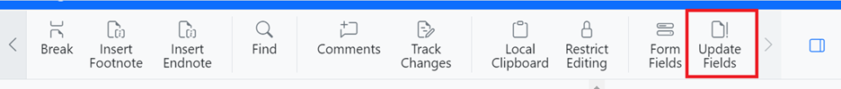

# Working with Fields in Blazor DocumentEditor Component

Fields are placeholders in a document that display data that can change, such as the current date, the total number of pages, or information from a data source (like in a mail merge). The [Blazor Word Processor](https://www.syncfusion.com/blazor-components/blazor-word-processor) (Document Editor) is designed to preserve all field types when loading an existing document, ensuring that no data or functionality is lost.

This document explains how to update fields and interact with them programmatically using the Document Editor's APIs.

## Automatic and Manual Field Updates

Certain fields are automatically updated by the Document Editor as the document's content changes.

### Automatically Updated Fields

The following fields are updated automatically without any user intervention:
*   `PAGE`: Displays the current page number.
*   `NUMPAGES`: Displays the total number of pages in the document.
*   `SECTION`: Displays the number of the current section.

### Manually Updating Fields

Other fields, such as bookmark cross-references, must be updated manually. This update can be triggered either through the user interface or programmatically.

#### Update via the UI

To update all fields in the document, click the **Update Fields** button in the **Review** tab of the toolbar.



#### Update Programmatically

To update the fields programmatically, use the [`UpdateFieldsAsync`](https://help.syncfusion.com/cr/blazor/Syncfusion.Blazor.DocumentEditor.DocumentEditor.html#Syncfusion_Blazor_DocumentEditor_DocumentEditor_UpdateFieldsAsync) method. This method updates all bookmark cross-reference fields in the document.

```csharp
// Updates all bookmark cross-reference fields in the document.
await container.DocumentEditor.UpdateFieldsAsync();
```

## Programmatically Interacting with Fields

The Document Editor provides APIs to insert fields and to get or set the information of an existing field.

### Inserting a Field

The following type of fields are automatically updated in Document Editor.

A new field can be inserted at the current selection using the [`InsertFieldAsync`](https://help.syncfusion.com/cr/blazor/Syncfusion.Blazor.DocumentEditor.EditorModule.html#Syncfusion_Blazor_DocumentEditor_EditorModule_InsertFieldAsync_System_String_System_String_) method. This requires specifying both the fieldCode and the `fieldResult`.

*   **Field Code**: The instruction that defines the field's behavior (e.g., `MERGEFIELD FirstName`).
*   **Field Result**: The text displayed in the document (e.g., `«FirstName»`).

The following example demonstrates how to insert a `MERGEFIELD`.

```csharp
// Defines the field's behavior.
string fieldCode = "MERGEFIELD  FirstName  \\* MERGEFORMAT ";
// Defines the placeholder text to display in the editor.
string fieldResult = "«First Name»";

await container.DocumentEditor.Editor.InsertFieldAsync(fieldCode, fieldResult);
```

N> The Document Editor does not validate the field code or result; it simply inserts a field with the provided information.

### Getting and Modifying Field Information

The properties of the currently selected field can be retrieved and modified as needed.

*   **Get Field Info**: Use the [`GetFieldInfoAsync`](https://help.syncfusion.com/cr/blazor/Syncfusion.Blazor.DocumentEditor.SelectionModule.html#Syncfusion_Blazor_DocumentEditor_SelectionModule_GetFieldInfoAsync) method to get a `FieldInfo` object containing the code and result of the selected field.
*   **Set Field Info**: Use the [`SetFieldInfoAsync`](https://help.syncfusion.com/cr/blazor/Syncfusion.Blazor.DocumentEditor.EditorModule.html#Syncfusion_Blazor_DocumentEditor_EditorModule_SetFieldInfoAsync_Syncfusion_Blazor_DocumentEditor_FieldInfo_) method to update the properties of the selected field with a modified `FieldInfo` object.

The following example shows how to get the information of a selected field and then modify it.

```csharp
// Gets the FieldInfo object for the currently selected field.
FieldInfo fieldInfo = await container.DocumentEditor.Selection.GetFieldInfoAsync();

// Modify the field's code and result.
fieldInfo.Code = "MERGEFIELD  LastName  \\* MERGEFORMAT ";
fieldInfo.Result = "«Last Name»";

// Apply the changes to the selected field.
await container.DocumentEditor.Editor.SetFieldInfoAsync(fieldInfo);
```

N> For nested fields, `GetFieldInfoAsync` returns the combined field code and result. When using `SetFieldInfoAsync` on a nested field, the entire field is replaced with the new information.

## See Also

*   [Mail Merge with Syncfusion DocIO](https://help.syncfusion.com/file-formats/docio/working-with-mail-merge)
*   For advanced, server-side mail merge operations to populate fields with data, consider using the Syncfusion DocIO library in your backend.
