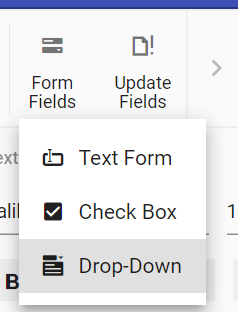

# Form Fields in Blazor Document Editor Component

The [Blazor Document Editor](https://www.syncfusion.com/docx-editor-sdk/blazor-docx-editor) (Document Editor) component provides support for inserting Text, CheckBox, and DropDown form fields through the built-in toolbar.



## Insert form field

Form fields can be inserted using [`InsertFormFieldAsync`](https://help.syncfusion.com/cr/blazor/Syncfusion.Blazor.DocumentEditor.EditorModule.html#Syncfusion_Blazor_DocumentEditor_EditorModule_InsertFormFieldAsync_Syncfusion_Blazor_DocumentEditor_FormFieldType_) method in editor module.

```csharp
//Insert Text form field
await container.DocumentEditor.Editor.InsertFormFieldAsync(FormFieldType.Text);
//Insert Checkbox form field
await container.DocumentEditor.Editor.InsertFormFieldAsync(FormFieldType.CheckBox);
//Insert Drop down form field
await container.DocumentEditor.Editor.InsertFormFieldAsync(FormFieldType.DropDown);
```

## Get form field names

All the form field names from the current document can be retrieved using [`GetFormFieldNamesAsync()`](https://help.syncfusion.com/cr/blazor/Syncfusion.Blazor.DocumentEditor.SfDocumentEditor.html#Syncfusion_Blazor_DocumentEditor_SfDocumentEditor_GetFormFieldNamesAsync).

```csharp
Task<List<string>> formFieldsNames = await container.DocumentEditor.GetFormFieldNamesAsync();
```

## Export form field data

Data of all the form fields in the document can be exported using [`ExportFormDataAsync`](https://help.syncfusion.com/cr/blazor/Syncfusion.Blazor.DocumentEditor.SfDocumentEditor.html#Syncfusion_Blazor_DocumentEditor_SfDocumentEditor_ExportFormDataAsync).

```csharp
Task<List<FormFieldData>> formFieldDatas = await container.DocumentEditor.ExportFormDataAsync();
```

## Import form field data

Form fields can be pre-filled with data using [`ImportFormDataAsync`](https://help.syncfusion.com/cr/blazor/Syncfusion.Blazor.DocumentEditor.SfDocumentEditor.html#Syncfusion_Blazor_DocumentEditor_SfDocumentEditor_ImportFormDataAsync_System_Collections_Generic_List_Syncfusion_Blazor_DocumentEditor_FormFieldData__).

```csharp
FormFieldData textformField = new FormFieldData();
textformField.FieldName = "Text1";
textformField.Value = "Hello World";
FormFieldData checkformField = new FormFieldData();
checkformField.FieldName = "Check1";
checkformField.Value = true;
FormFieldData dropdownformField = new FormFieldData();
dropdownformField.FieldName = "Drop1";
dropdownformField.Value = 1;
   
List<FormFieldData> formData = new List<FormFieldData>();
formData.Add(textformField);
formData.Add(checkformField);
formData.Add(dropdownformField);
//import form field data
await container.DocumentEditor.ImportFormDataAsync(formData);
```

## Reset form fields

Reset all the form fields in the current document to their default value using [`ResetFormFieldsAsync`](https://help.syncfusion.com/cr/blazor/Syncfusion.Blazor.DocumentEditor.SfDocumentEditor.html#Syncfusion_Blazor_DocumentEditor_SfDocumentEditor_ResetFormFieldsAsync_System_String_).

```csharp
await container.DocumentEditor.ResetFormFieldsAsync();
```

## Protect the document in form filling mode

Document Editor provides support for protecting the document with `FormFieldsOnly` protection. In this protection, the user can only fill form fields in the document.

The Document Editor provides an option to protect and unprotect a document using the [`EnforceProtectionAsync`](https://help.syncfusion.com/cr/blazor/Syncfusion.Blazor.DocumentEditor.EditorModule.html#Syncfusion_Blazor_DocumentEditor_EditorModule_EnforceProtectionAsync_System_String_Syncfusion_Blazor_DocumentEditor_ProtectionType_) and [`StopProtectionAsync`](https://help.syncfusion.com/cr/blazor/Syncfusion.Blazor.DocumentEditor.EditorModule.html#Syncfusion_Blazor_DocumentEditor_EditorModule_StopProtectionAsync_System_String_) APIs.

The following example code illustrates how to enforce and stop protection in the Document Editor container.

```csharp
@using Syncfusion.Blazor.DocumentEditor

<button @onclick="protectDocument">Protection</button>
<SfDocumentEditorContainer @ref="container" EnableToolbar=true></SfDocumentEditorContainer>

@code {
    SfDocumentEditorContainer container;
    protected async void protectDocument(object args)
    {
        //enforce protection
        await container.DocumentEditor.Editor.EnforceProtectionAsync("123", ProtectionType.FormFieldsOnly);
        //stop the document protection
        await container.DocumentEditor.Editor.StopProtectionAsync("123");
    }
}
```

N> In the `EnforceProtection` method, the first parameter denotes the password and the second parameter denotes the protection type. Possible values of protection type are `NoProtection | ReadOnly | FormFieldsOnly | CommentsOnly`. In the `StopProtection` method, the parameter denotes the password.

## Online Demo

Explore how to insert and manage form fields in Word documents using the Blazor Document Editor in this live demo [here](https://document.syncfusion.com/demos/docx-editor/blazor-server/document-editor/form-fields?theme=fluent2).