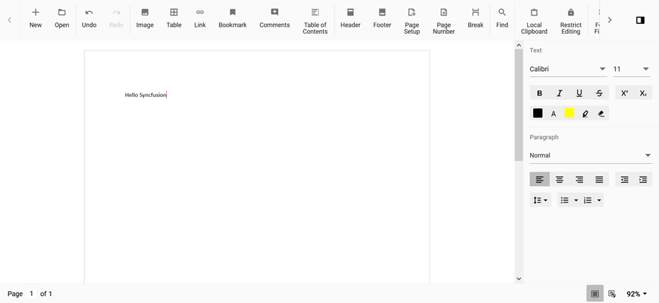

# Change the Cursor Color in Blazor Document Editor

The [Blazor Word Processor](https://www.syncfusion.com/blazor-components/blazor-word-processor) (Document Editor) component uses a black cursor by default. However, this color can be easily customized by overriding the corresponding CSS class.

The editor's blinking cursor is styled using the `.e-de-blink-cursor` CSS class. To change its color, you can define a new style for this class with a different `border-left` property.

## Applying the CSS Override

```css
.e-de-blink-cursor {
    border-left: 1px solid red !important;
}
```

N> The `!important` declaration is used here to ensure this custom style takes precedence over the component's default styles.

After applying this CSS, the cursor in the Document Editor will appear in the new color.


