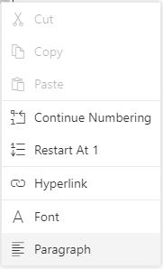

# Working with Lists in Blazor DocumentEditor Component

Lists are a fundamental feature for organizing content in a document, making it easier for readers to follow step-by-step instructions or grasp key points. The [Blazor Word Processor](https://www.syncfusion.com/blazor-components/blazor-word-processor) (Document Editor) provides comprehensive support for single-level and multilevel lists, which can be either ordered (numbered) or unordered (bulleted).

### Create a Bulleted List

Bulleted (unordered) lists are ideal for items that do not need to be in a specific sequence. Use the `ApplyBulletAsync` method to apply a bullet format to the selected paragraphs. The method accepts a bullet character and its font family.

|Parameter|Type|Description|
|---------|----|-----------|
|Bullet|string|Bullet character.|
|fontFamily|string|Bullet font family.|

Refer to the following sample code.

```csharp
@* The following code example demonstrates how to apply a standard circular bullet. *@
await container.DocumentEditor.Editor.ApplyBulletAsync("\u00B7", "Symbol");
```

### Create a Numbered List

Numbered (ordered) lists are used for sequential items. Use the `ApplyNumberingAsync` method to apply a numbering format. This method allows you to define the number format and the character style for the list level.

The `numberFormat` parameter uses placeholders like `%1`, `%2`, etc., which correspond to the value of each list level. The `ListLevelPattern` specifies the character style for the number (e.g., Arabic numerals, Roman numerals, or letters).

| Parameter | Type | Description |
|---|---|---|
| `numberFormat` | `string` | Defines the pattern for the list number. For example, `"%1."` will produce "1.", "2.", etc. |
| `listLevelPattern` | `ListLevelPattern` | (Optional) Specifies the character style for the list numbers. Defaults to `Arabic`. Options include `UpRoman`, `LowRoman`, `UpLetter`, `LowLetter`, etc. |

```csharp
@* The following code example applies an uppercase Roman numeral format to the selected list. *@
await container.DocumentEditor.Editor.ApplyNumberingAsync("%1.", ListLevelPattern.UpRoman);
```

## Clear list

To remove all list formatting from a selection of paragraphs and revert them to normal text, use the `ClearListAsync` method.

```csharp
@* The following code example removes list formatting from the current selection. *@
await container.DocumentEditor.Editor.ClearListAsync();
```

## Editing Numbered Lists

The Document Editor provides options for controlling the sequence of numbered lists.

### Restarting and Continuing Numbering

When working with numbered lists, you can choose to restart numbering at "1" or continue the sequence from a previous list. These options are available in the context menu when you right-click on a list number.

