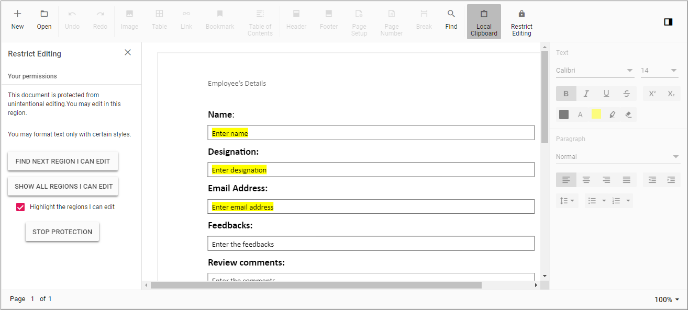
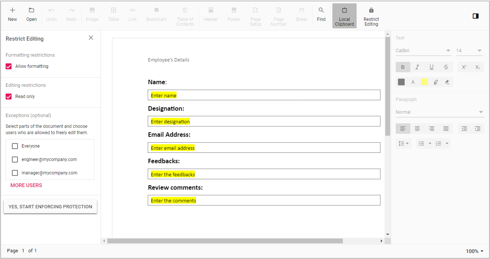

# Restrict editing in Blazor DOCX Editor

Syncfusion® [Blazor Word Processor control](https://www.syncfusion.com/blazor-components/blazor-word-processor)  (Document Editor) provides support for restricting editing within a document. It enables control over how and where content can be modified. This helps limit editing so only specific sections of the document can be changed.

## Read only mode

Document Editor supports protecting a document in read-only mode, where users can only view the content without making changes.

The following code example shows how to restrict or protect editing for the entire content (show as read-only).

```cshtml
@using Syncfusion.Blazor.DocumentEditor

<button @onclick="ReadOnly">Read Only</button>
<SfDocumentEditorContainer @ref="container" EnableToolbar=true></SfDocumentEditorContainer>

@code {
    SfDocumentEditorContainer container;

    public void ReadOnly(object args)
    {
        container.RestrictEditing = true;
    }
}
```

## Form filling mode

Document Editor supports protecting a document with form-filling restrictions, allowing users to edit only form fields.

The following code example illustrates how to enforce form-filling protection in the Document Editor.

```cshtml
@using Syncfusion.Blazor.DocumentEditor

<button @onclick="EnforceProtection">Enforce Protection</button>
<button @onclick="StopProtection">Stop Protection</button>
<SfDocumentEditorContainer @ref="container" EnableToolbar=true></SfDocumentEditorContainer>

@code {
    SfDocumentEditorContainer container;

    public async void EnforceProtection(object args)
    {
        // enforce form fields only protection
        await container.DocumentEditor.Editor.EnforceProtectionAsync("123", ProtectionType.FormFieldsOnly);
    }

    public async void StopProtection(object args)
    {
        // stop the document protection
        await container.DocumentEditor.Editor.StopProtectionAsync("123");
    }
}
```

## Comments only mode

Document Editor supports protecting a document in comments-only mode, allowing users to add or edit comments only.

The following code example illustrates how to enforce and remove comments-only protection in the Document Editor.

```cshtml
@using Syncfusion.Blazor.DocumentEditor

<button @onclick="EnforceProtection">Enforce Protection</button>
<button @onclick="StopProtection">Stop Protection</button>
<SfDocumentEditorContainer @ref="container" EnableToolbar=true></SfDocumentEditorContainer>

@code {
    SfDocumentEditorContainer container;

    public async void EnforceProtection(object args)
    {
        // enforce comments only protection
        await container.DocumentEditor.Editor.EnforceProtectionAsync("123", ProtectionType.CommentsOnly);
    }

    public async void StopProtection(object args)
    {
        // stop the document protection
        await container.DocumentEditor.Editor.StopProtectionAsync("123");
    }
}
```

## Track changes only mode

Document Editor supports protecting a document in revisions-only mode, allowing users to view the document and make corrections while tracking all changes. Users cannot accept or reject tracked changes; only the author can review and finalize them later.

The following code example illustrates how to enforce and remove revisions-only protection in the Document Editor.

```cshtml
@using Syncfusion.Blazor.DocumentEditor

<button @onclick="EnforceProtection">Enforce Protection</button>
<button @onclick="StopProtection">Stop Protection</button>
<SfDocumentEditorContainer @ref="container" EnableToolbar=true></SfDocumentEditorContainer>

@code {
    SfDocumentEditorContainer container;

    public async void EnforceProtection(object args)
    {
        // enforce revisions only protection
        await container.DocumentEditor.Editor.EnforceProtectionAsync("123", ProtectionType.RevisionsOnly);
    }

    public async void StopProtection(object args)
    {
        // stop the document protection
        await container.DocumentEditor.Editor.StopProtectionAsync("123");
    }
}
```

## Allows changes to certain portion of the document

Also, at some situations, you might need to allow changes for a certain portion of the document alone. Microsoft Word allows you to [make changes to parts of a Word document](https://support.microsoft.com/en-us/office/allow-changes-to-parts-of-a-protected-document-187ed01c-8795-43e1-9fd0-c9fca419dadf?ui=en-us&rs=en-us&ad=us). Likewise, the document editor control allows the users to make changes to certain parts of a document using similar user interface.





## Set current user

The `CurrentUser` property can be used to authorize the current document user by name, email, or user group.

The following code example demonstrates how to set the CurrentUser.

```cshtml
container.DocumentEditor.CurrentUser = "engineer@mycompany.com";
```

## Highlighting the text area

The `UserColor` property can be used to highlight the editable region of the current user.

The following code example demonstrates how to set the UserColor.

```cshtml
container.DocumentEditor.UserColor = "#fff000";
```

The `HighlightEditableRanges` property can be used to toggle the highlighting of editable regions.

The following code example demonstrates how to enable or disable editable region highlighting.

```cshtml
container.DocumentEditor.DocumentEditorSettings.HighlightEditableRanges = true;
```

## Online Demo

Explore how to restrict editing and protect Word documents using the Blazor Document Editor in this live demo [here](https://document.syncfusion.com/demos/docx-editor/blazor-server/document-editor/document-protection?theme=fluent2).