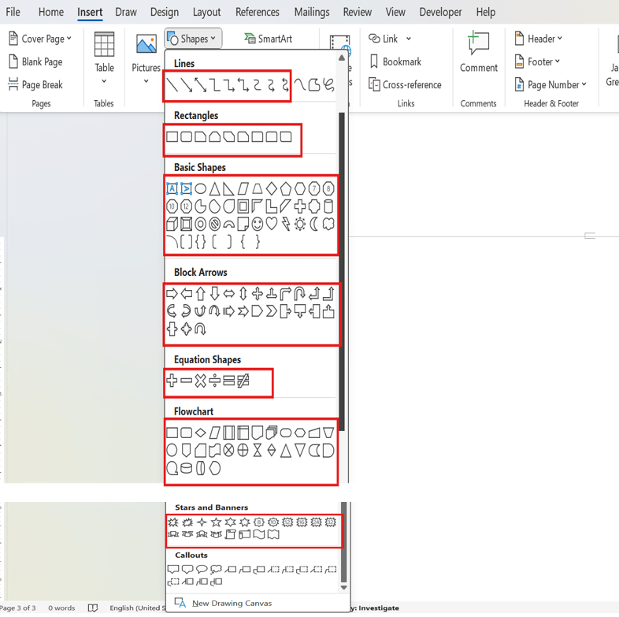
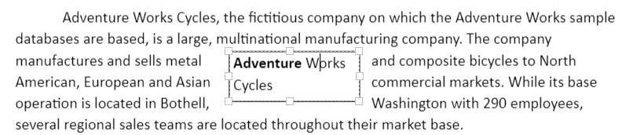
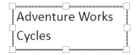

# Working with Shapes in Blazor DocumentEditor

Shapes are drawing objects that include a text box, rectangles, lines, curves, circles, etc. It can be preset or custom geometry. At present, DocumentEditor does not have support to insert shapes. however, if the document contains a shape while importing, it will be preserved properly.

## Supported shapes

The DocumentEditor has preservation support for Lines, Rectangle, Basic Shapes, Block Arrows, Equation Shapes, Flowchart and Stars and Banners.

N> When using ASP.NET MVC service, the unsupported shapes will be converted as image and preserved as image.

## Text box Shape

A text box is a rectangular area on the document where you can enter text. Clicking in a text box displays a flashing cursor, indicating that text can be entered. It allows you to enter multiple lines of text with all text formatting.

## Shape Resizer

The DocumentEditor also supports a built-in shape resizer to resize the shapes present in the document. The shape resizer accepts both touch and mouse interactions.

## Text wrapping style

Text wrapping refers to how shapes fit with surrounding text in a document. [Refer to this page](./text-wrapping-style) for more information about text wrapping styles available in Word documents.

## Positioning the shape

DocumentEditor preserves the position properties of the shape and displays the shape based on position properties. It does not support modifying the position properties. Whereas the shape will be automatically moved along with text edited if it is positioned relative to the line or paragraph.
