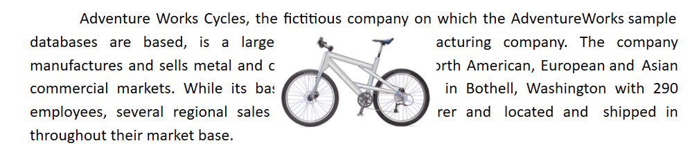
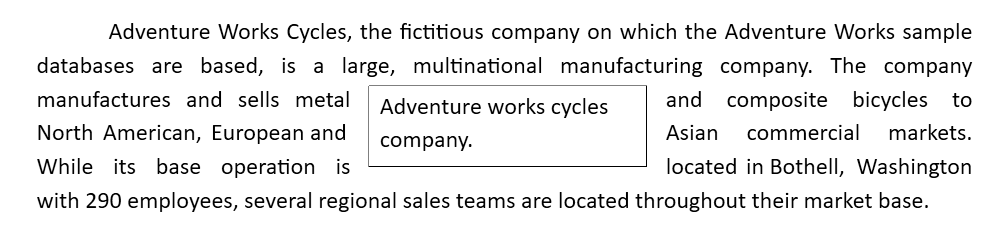

# Text Wrapping Style in Blazor Document Editor Component

Text wrapping refers to how images and shapes are fit with surrounding text in a document. Currently, [Blazor Document Editor](https://www.syncfusion.com/docx-editor-sdk/blazor-docx-editor) (Document Editor) has only preservation support for image and text box shapes with the following wrapping styles.

## In-Line with Text

In this option, the image or shape is placed inline with the surrounding text like any other word or letter. This image or shape will be automatically moved along with the text while editing, whereas the other options keep the image or shape in a fixed position while the text shifts and wraps around it.

## In Front of Text

In this option, the image or shape is placed in front of the text. This can be used to place an image around some text or to add a shape to highlight a part in a paragraph.

N> Starting from v18.2.0.x, the in-front-of-text wrapping style is supported.

## Top and Bottom

In this option, the text wraps above and below the image or shape. No text appears to the left or right of the image or shape. This can be used for large images or shapes that span most of the page width.

N> Starting from v19.1.0.x, the top and bottom wrapping style is supported.

## Behind

In this option, the image or shape is placed behind the text. This can be used when you need to add a watermark or background image to a document.

N> Starting from v19.2.0.x, the behind text wrapping style is supported.

## Square

In this option, the text wraps around the image or text box in a square shape.

N> Tight and Through styles will be preserved as the square wrapping style in Document Editor, which is supported from v19.2.0.x.

