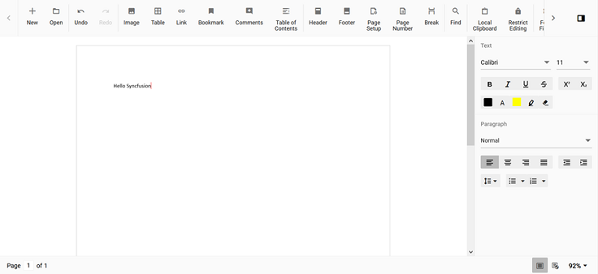

# How to Change Cursor Color in JavaScript DOCX Editor

[JavaScript DOCX Editor](https://www.syncfusion.com/docx-editor-sdk/javascript-docx-editor) (Document Editor) default cursor color is black. The user can change the color by overriding the css property using class name. The Document editor cursor css have a class named `e-de-blink-cursor`.

Please refer the below code snippet to change the cursor color to red.

```
.e-de-blink-cursor {
border-left: 1px solid red!important;
}
```

Output will be like below:


