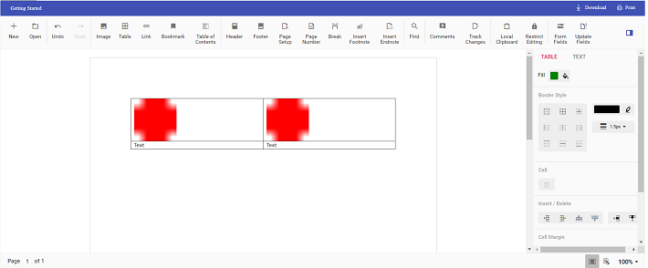

# Insert text or image in table programmatically in EJ2 Javascript Document editor control

Using Document editor API's, you can insert [`text`](../how-to/insert-text-in-current-position#insert-text-in-current-cursor-position) or [`image`](../image#images) in [`table`](../table#create-a-table) programmatically based on your requirement.

Use [`selection`](../how-to/move-selection-to-specific-position#selects-content-based-on-start-and-end-hierarchical-index) API's to navigate between rows and cells.

The following example illustrates how to create 2*2 table and then add text and image programmatically.

```ts
import { DocumentEditorContainer, Toolbar } from '@syncfusion/ej2-documenteditor';

DocumentEditorContainer.Inject(Toolbar);

let container: DocumentEditorContainer = new DocumentEditorContainer({ enableToolbar: true, height: '590px' });

container.serviceUrl = 'https://services.syncfusion.com/js/production/api/documenteditor/';

container.appendTo('#container');
// To insert the table in cursor position
container.documentEditor.editor.insertTable(2,2);
// To insert the image at table first cell
container.documentEditor.editor.insertImage("data:image/png;base64,iVBORw0KGgoAAAANSUhEUgAAAAUAAAAFCAYAAACNbyblAAAAHElEQVQI12P4    //8/w38GIAXDIBKE0DHxgljNBAAO9TXL0Y4OHwAAAABJRU5ErkJggg==");
// To move the cursor to next cell
moveCursorToNextCell();
// To insert the image at table second cell
container.documentEditor.editor.insertImage("data:image/png;base64,iVBORw0KGgoAAAANSUhEUgAAAAUAAAAFCAYAAACNbyblAAAAHElEQVQI12P4    //8/w38GIAXDIBKE0DHxgljNBAAO9TXL0Y4OHwAAAABJRU5ErkJggg==");
// To move the cursor to next row
moveCursorToNextRow();
// To insert text in cursor position
container.documentEditor.editor.insertText('Text');
// To move the cursor to next cell
moveCursorToNextCell();
// To insert text in cursor position
container.documentEditor.editor.insertText('Text');

function moveCursorToNextCell() {
// To get current selection start offset
var startOffset=container.documentEditor.selection.startOffset;
// Increasing cell index to consider next cell
var cellIndex= parseInt(startOffset.substring(6, 7)) + 1;
// Changing start offset
startOffset = startOffset.substring(0, 6) + cellIndex.toString() + startOffset.substring(7, startOffset.length);
// Navigating selection using select method
container.documentEditor.selection.select(startOffset, startOffset);
}

function moveCursorToNextRow() {
// To get current selection start offset
var startOffset=container.documentEditor.selection.startOffset;
// Increasing row index to consider next row
var rowIndex= parseInt(startOffset.substring(4, 5)) + 1;
var cellIndex= parseInt(startOffset.substring(6,7)) != 0? parseInt(startOffset.substring(6,7)) - 1:0;
// Changing start offset
startOffset = startOffset.substring(0, 4) + rowIndex.toString() + startOffset.substring(5, 6) + cellIndex + startOffset.substring(7, startOffset.length);
// Navigating selection using select method
container.documentEditor.selection.select(startOffset, startOffset);
}
```

> The Web API hosted link `https://services.syncfusion.com/js/production/api/documenteditor/` utilized in the Document Editor's serviceUrl property is intended solely for demonstration and evaluation purposes. For production deployment, please host your own web service with your required server configurations. You can refer and reuse the [GitHub Web Service example](https://github.com/SyncfusionExamples/EJ2-DocumentEditor-WebServices) or [Docker image](https://hub.docker.com/r/syncfusion/word-processor-server) for hosting your own web service and use for the serviceUrl property.

The output will be like below.

