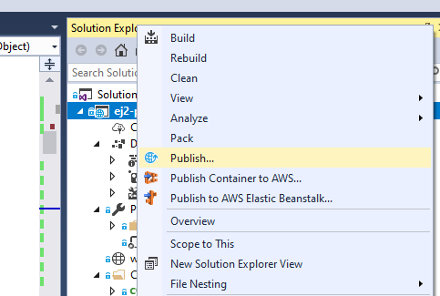
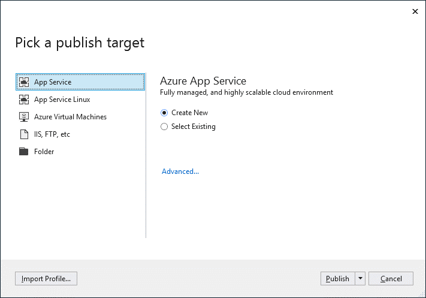

# How to publish documenteditor web api application in azure app service from visual studio in ##javascript-es5## Document editor control

## Prerequisites

* Visual Studio 2017, 2019, or 2022.
* An [`Azure subscription`](https://azure.microsoft.com/en-gb/).
* The Document Editor Web API controller application from [`here`](https://github.com/SyncfusionExamples/EJ2-DocumentEditor-WebServices).

Make sure you build the project using the **Build > Build Solution** menu command before following the deployment steps.

## Publish to Azure App Service

**Step 1:** In Solution Explorer, right-click the project and click **Publish** (or use the **Build > Publish** menu item).

**Step 2:** If you have previously configured any publishing profiles, the **Publish** pane appears; in that case, select **Create a new profile**.

**Step 3:** In the Pick a publish target dialog box, select App Service.

**Step 4:** Select **Publish**. The **Create App Service** dialog box appears. Sign in with your Azure account, if necessary, and then the default App Service settings populate the fields.

**Step 5:** Select **Create**. Visual Studio deploys the app to your Azure App Service, and the web app loads in your browser at `http://<app_name>.azurewebsites.net` (for example, `http://ej2-documenteditor-server20200514102909.azurewebsites.net`).

**Step 6:** Navigate to the Document Editor Web API at `http://<app_name>.azurewebsites.net/api/documenteditor/`. It returns the default GET-method response.

Append the running App Service URL `http://<app_name>.azurewebsites.net/api/documenteditor/` to the `serviceUrl` in the client-side Document Editor control. For more information about how to get started with the Document Editor control, refer to the [`Getting Started` page](../getting-started).

For more information about a production-ready setup, see the [`Microsoft Azure App Service`](https://docs.microsoft.com/en-us/visualstudio/deployment/) documentation.
