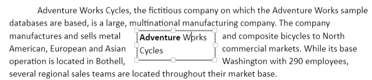
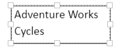

# Shapes in JavaScript DOCX Editor

Shapes are drawing objects that include a text box, rectangles, lines, curves, circles, etc. They can be preset or custom geometry. At present, [JavaScript DOCX Editor](https://www.syncfusion.com/docx-editor-sdk/javascript-docx-editor) (Document Editor) does not have support to insert shapes. However, if the imported document contains shapes, they are preserved within the editor.

## Supported shapes

The Document Editor has preservation support for Lines, Rectangle, Basic Shapes, Block Arrows, Equation Shapes, Flowchart, and Stars and Banners.

N> When using ASP.NET MVC service, the unsupported shapes are converted to images and preserved as images.

## Text Box Shape

A text box is a rectangular area on the document where you can enter text. When you click in a text box, a flashing cursor appears, indicating that you can begin typing. It allows you to enter multiple lines of text with all text formatting.

## Shape Resizer

The Document Editor also supports a built-in shape resizer to resize the shapes present in the document. The shape resizer accepts both touch and mouse interactions.

## Text wrapping style

Text wrapping refers to how shapes fit with surrounding text in a document. Please [refer to this page](./text-wrapping-style) for more information about text wrapping styles available in Word documents.

## Positioning the shape

Document Editor preserves the position properties of the shape and displays the shape based on position properties. It does not support modifying the position properties. However, the shape moves automatically with the surrounding text if it is positioned relative to the line or paragraph.

## Online Demo

Explore how to preserve autoshapes and grouped shapes in Word documents using the JavaScript (ES5) Document Editor in this live demo [here](https://document.syncfusion.com/demos/docx-editor/javascript-es5/#/material3/document-editor/autoshapes.html).
