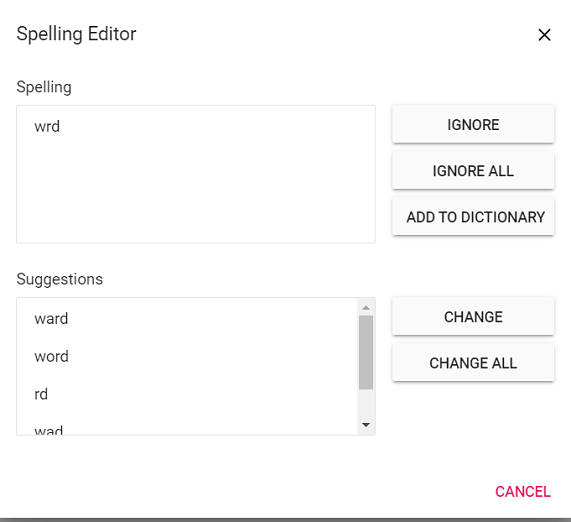

# Spell check in JavaScript (ES5) Document editor control

[JavaScript DOCX Editor](https://www.syncfusion.com/docx-editor-sdk/javascript-docx-editor) (Document Editor) supports performing spell checking for any input text. You can perform spell checking for the text in Document Editor. It provides suggestions for misspelled words through a dialog and the context menu. Document Editor's spell checker is compatible with [hunspell dictionary files](https://github.com/wooorm/dictionaries).

```ts
import { DocumentEditorContainer, Toolbar, SpellChecker } from '@syncfusion/ej2-documenteditor';

DocumentEditorContainer.Inject(Toolbar);
let container: DocumentEditorContainer = new DocumentEditorContainer({
    enableToolbar: true, enableSpellCheck: true
});
container.appendTo('#container');
// Accessing spell checker.
let spellChecker: SpellChecker = container.documentEditor.spellChecker;
// Set language ID to map the dictionary on the server side.
spellChecker.languageID = 1033;
spellChecker.removeUnderline = false;
// Allow suggestion for misspelled words.
spellChecker.allowSpellCheckAndSuggestion = true;
```

N> Document Editor requires server-side dependencies for spell check configuration. Refer to the [Document Editor Web API service projects](https://help.syncfusion.com/document-processing/word/word-processor/javascript-es5/web-services/core) link for configuring spell checker on the server side. To know about server-side dependencies, please refer to this [page](./web-services-overview).

## Features

* Supports context menu suggestions.
* Provides built-in options to Ignore, Ignore All, Change, Change All for error words in the spell checker dialog.

## Enable SpellCheck

To enable spell check in Document Editor, set [`enableSpellCheck`](https://ej2.syncfusion.com/javascript/documentation/api/document-editor#enablespellcheck) property as `true` and then configure SpellCheckSettings.

## Disable SpellCheck

To disable spell check in Document Editor, set [`enableSpellCheck`](https://ej2.syncfusion.com/javascript/documentation/api/document-editor#enablespellcheck) property as `false` or remove [`enableSpellCheck`](https://ej2.syncfusion.com/javascript/documentation/api/document-editor#enablespellcheck) property initialization code. The default value of this property is false.

## Spell check settings

### Remove Underline

By default, misspelled words are marked with a squiggly line. You can also disable this behavior by enabling the [`removeUnderline`](https://ej2.syncfusion.com/javascript/documentation/api/document-editor/spellChecker#removeunderline) API, and the squiggly lines will no longer be rendered for misspelled words.

```ts
documentEditor.spellChecker.removeUnderline = false;
```

### AllowSpellCheckAndSuggestion

By default, on performing spell check in Document Editor, both spelling and suggestions of the misspelled words are retrieved, and these misspelled words can be corrected through context menu suggestions. You can modify this behavior using the [`allowSpellCheckAndSuggestion`](https://ej2.syncfusion.com/javascript/documentation/api/document-editor/spellChecker#allowspellcheckandsuggestion) API, which performs only spell check.

```ts
documentEditor.spellChecker.allowSpellCheckAndSuggestion = false;
```

### LanguageID

Document Editor provides multi-language spell check support. You can add as many languages (dictionaries) on the server side. To use that language for spell checking in Document Editor, it must match the [`languageID`](https://ej2.syncfusion.com/javascript/documentation/api/document-editor/spellChecker#languageid) you set in the Document Editor.

```ts
documentEditor.spellChecker.languageID = 1033; // LCID of "en-us".
```

### EnableOptimizedSpellCheck

Document Editor provides an option to spell check page by page when loading documents. The default value of this property is false, so when opening the document, the spell check web API is called for each word in the document. To optimize the frequency of spell check web API calls, you can enable this property.

The following code example illustrates how to enable optimized spell checking.

```ts
documentEditor.spellChecker.enableOptimizedSpellCheck = true;
```

### Spell check dictionary cache

Starting from `v20.1.0.xx`, the performance and memory usage of the spell checker have been optimized by adding a static method to initialize the dictionaries with a specified cache count.

By default, the spell checker holds only one language dictionary in memory. If you want to hold multiple dictionaries in memory, you need to set the cache limit using the `InitializeDictionaries` method as in the below example.

```c#
List<DictionaryData> spellDictCollection = new List<DictionaryData>();
string personalDictPath = string.Empty;
int cacheCount = 2;

// Initialize dictionaries
SpellChecker.InitializeDictionaries(spellDictCollection, personalDictPath, cacheCount);
```

If dictionaries are initialized using the `InitializeDictionaries` method, you should use the default constructor of the `SpellChecker` to check spelling and get suggestions, as in the code example below; this prevents reinitialization of already loaded dictionaries.

```c#
public string SpellCheck([FromBody] SpellCheckJsonData spellChecker)
{
    try
    {
        SpellChecker spellCheck = new SpellChecker();
        spellCheck.GetSuggestions(spellChecker.LanguageID, spellChecker.TexttoCheck, spellChecker.CheckSpelling, spellChecker.CheckSuggestion, spellChecker.AddWord);
        return Newtonsoft.Json.JsonConvert.SerializeObject(spellCheck);
    }
    catch
    {
        return "{\"SpellCollection\":[],\"HasSpellingError\":false,\"Suggestions\":null}";
    }
}
```

Previously, on every `SpellChecker.GetSuggestion()` method call, the `.aff` and dictionary data were parsed to generate suggestions for misspelled words. Starting from `v20.1.0.xx`, the `.aff` and dictionary data are parsed only on the first call to the `SpellChecker.GetSuggestion()` method.

### Add new root word and possible words to dictionary

If you find that a root word is missing in the dictionary file, you can add that new root word and the rule to form the possible words to the dictionary file using the `AddNewWord` API in the server-side Spell check library.

N> 1. The rules are framed automatically using the root word, the possible words, and the affix file.
N> 2. If you pass null for the parameters `affPath` and `possibleWords`, only a single root word is added to the dictionary.
N> 3. This API is included starting from `v20.2.0.xx`.

The following code example demonstrates how to add a new root word to the dictionary along with the rule to form the possible words.

```c#
SpellChecker spellChecker = new SpellChecker();
// Adds the specified new root word to the dictionary along with the rule to form the possible words.
spellChecker.AddNewWord("en.dic","en.aff", "construct", new string[] { "constructs", "reconstruct", "constructed", "constructive" });
```

## Context menu

Right-click on an incorrect word to open the context menu with spell check options. Please see the screenshot below for your reference.


### Suggestions

The context menu shows suggestions for misspelled words. Click a suggestion to replace the word automatically.

### Add To Dictionary

Using this option, you can add the current word to the dictionary so that the spell checker no longer flags it as an error.

### Ignore Once and Ignore All

If you do not want to add the word to the dictionary and do not want to show the error, use the Ignore Once or Ignore All options.

Ignore: ignores only the current occurrence of the word.

Ignore All: ignores all occurrences of the word in the entire document.

### Spelling

Using this option, you can open the spell check dialog. Please see the screenshot below for your reference.



N> Refer to the [Spell checker](https://help.syncfusion.com/document-processing/word/word-processor/javascript-es5/web-services/core#spell-check) link for configuring spell checker on the server side.
