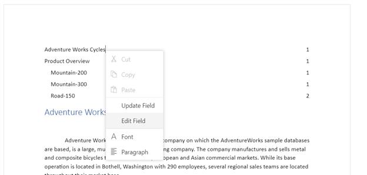

# Table of Contents in JavaScript DOCX Editor

The table of contents in a document is the same as the list of chapters at the beginning of a book. It lists each heading in the document and the page number where that heading starts, with various options to customize the appearance.

## Inserting a table of contents

[JavaScript DOCX Editor](https://www.syncfusion.com/docx-editor-sdk/javascript-docx-editor) (Document Editor) exposes an API to insert a table of contents at the cursor position programmatically. You can specify the settings for the table of contents explicitly. Otherwise, the default settings will be applied.

The [`TableOfContentsSettings`](https://ej2.syncfusion.com/javascript/documentation/api/document-editor/tableOfContentsSettings) class contains the following properties:
* **startLevel**: Specifies the start level for constructing the table of contents.
* **endLevel**: Specifies the end level for constructing the table of contents.
* **includeHyperlink**: Specifies whether the link for headings is included.
* **includePageNumber**: Specifies whether the page number of the headings is included.
* **rightAlign**: Specifies whether the page number is right-aligned.
* **tabLeader**: Specifies the tab leader styles such as none, dot, hyphen, and underscore.
* **includeOutlineLevels**: Specifies whether the outline levels are included.

The following code illustrates how to insert a table of contents in DOCX Editor.

```js
var tocSettings = 
{
      startLevel: 1, endLevel: 3, includeHyperlink: true, includePageNumber: true, rightAlign: true
};
// Insert a table of contents in Document Editor.
editor.editorModule.insertTableOfContents(tocSettings);
```









          


## Update or edit the table of contents

You can update or edit the table of contents using the built-in context menu that appears when you right-click it. Refer to the following screenshot.



* **Update Field**: Updates the headings in the table of contents with the same settings by searching the entire document.
* **Edit Field**: Opens the built-in table of contents dialog and allows you to modify its settings.

You can also update or edit it programmatically by using the exposed API. Refer to the following sample code.

```js

var documentEditor = new ej.documenteditor.DocumentEditor({ enableEditor: true, isReadOnly: false, enableSelection: true });
documentEditor.appendTo('#DocumentEditor');
/*Open any existing document*/
documentEditor.open('');
// Table of contents settings.
var tocSettings = {
      startLevel: 1, endLevel: 3, includeHyperlink: true, includePageNumber: true, rightAlign: true
};
// Insert a table of contents in Document Editor.
documentEditor.editorModule.insertTableOfContents(tocSettings);

```

N> The same method is used for inserting, updating, and editing the table of contents. This works based on the current element at the cursor position and the optional settings parameter. If a table of contents is present at the cursor position, the update operation is performed based on the optional settings parameter. Otherwise, the insert operation is performed.

## Online Demo

Explore how to insert and update table of contents in Word documents using the JavaScript (ES5) DOCX Editor in this live demo [here](https://document.syncfusion.com/demos/docx-editor/javascript-es5/#/material3/document-editor/table-of-contents.html).

## See Also

* [Table of contents dialog](./dialog#table-of-contents-dialog)
