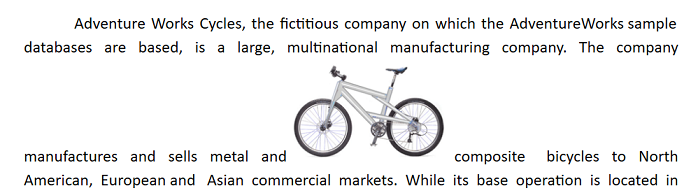
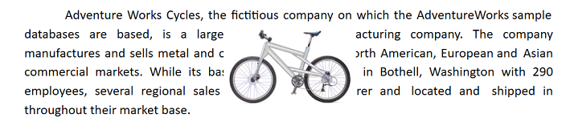
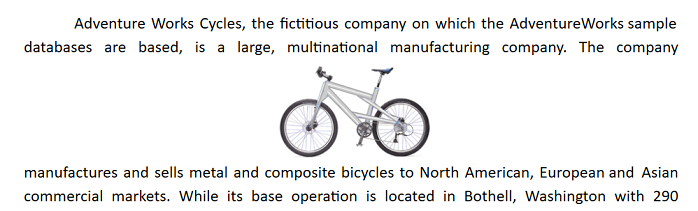
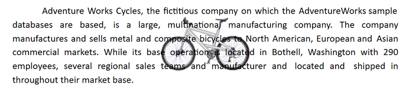
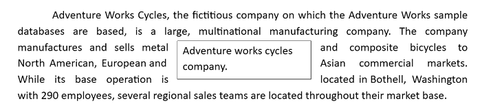

# Text Wrapping Style in JavaScript DOCX Editor

Text wrapping refers to how images and shapes are fit with surrounding text in a document. Currently, [JavaScript DOCX Editor](https://www.syncfusion.com/docx-editor-sdk/javascript-docx-editor) (Document Editor) has only preservation support for images and textbox shapes with the wrapping styles listed below.

## In-Line with Text

In this option, the image or shape is placed on the same line as the surrounding text, like any other word or letter. This image or shape will be automatically moved along with the text while editing, whereas the other options denote that the image or shape stays in a fixed position while the text shifts and wraps around it.

## In Front of Text

In this option, the image or shape is placed in front of the text. This can be used to place an image over text or to add a shape to highlight part of a paragraph.

N> Starting from v18.2.0.x, the "In Front of Text" wrapping style is supported.

## Top and Bottom

In this option, text wraps above and below the image or shape. No text is to the left or right of the image or shape. This can be used for larger images or shapes that occupy most of the width in a document.

N> Starting from v19.1.0.x, the "Top and Bottom" wrapping style is supported.

## Behind

In this option, the image or shape is placed behind the text. This can be used when you need to add a watermark or background image to a document.

N> Starting from v19.2.0.x, the "Behind" wrapping style is supported.

## Square

In this option, text wraps around the image or text box in a square shape.

N> The "Tight" and "Through" styles are preserved as the "Square" wrapping style in Document Editor, supported from v19.2.0.x.
