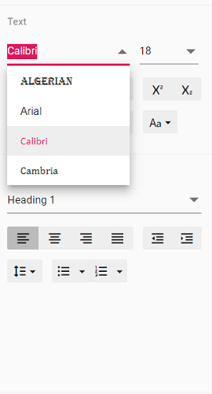

# Customize Font Family Drop-Down in JavaScript (ES6) Document Editor control

[TypeScript DOCX Editor](https://www.syncfusion.com/docx-editor-sdk/javascript-docx-editor) (Document Editor) provides an option to customize the font family drop-down list values using [`fontfamilies`](https://ej2.syncfusion.com/documentation/api/document-editor/documentEditorSettingsModel#fontfamilies) in the Document Editor settings. Fonts added to the `fontFamilies` of [`documentEditorSettings`](https://ej2.syncfusion.com/documentation/api/document-editor-container#documenteditorsettings) will be displayed in the font drop-down list of the text properties pane and the font dialog.

Similarly, you can use the [`documentEditorSettings`](https://ej2.syncfusion.com/documentation/api/document-editor#documenteditorsettings) property for the DocumentEditor as well.

The following example code illustrates how to change the font families in the Document Editor container.

```ts
let container: DocumentEditorContainer = new DocumentEditorContainer({ enableToolbar: true, height: '590px',
// Add required font families to list them in the font drop-down
  documentEditorSettings: {
    fontFamilies: ['Algerian', 'Arial', 'Calibri', 'Wingdings'],
  }
});
DocumentEditorContainer.Inject(Toolbar);
container.serviceUrl = 'https://document.syncfusion.com/web-services/docx-editor/api/documenteditor/';
container.appendTo('#container');
```

N> The Web API hosted link `https://document.syncfusion.com/web-services/docx-editor/api/documenteditor/` utilized in the Document Editor's serviceUrl property is intended solely for demonstration and evaluation purposes. For production deployment, please host your own web service with your required server configurations. You can refer and reuse the [GitHub Web Service example](https://github.com/SyncfusionExamples/EJ2-DocumentEditor-WebServices) or [Docker image](https://hub.docker.com/r/syncfusion/word-processor-server) for hosting your own web service and use for the serviceUrl property.

The output will be as shown below:

