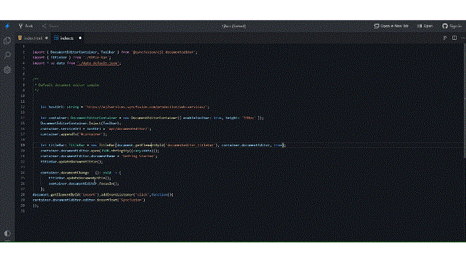

# Insert Text at Current Position in JavaScript (ES6) Document Editor

You can insert the text, paragraph, and rich-text content in the [TypeScript DOCX Editor](https://www.syncfusion.com/docx-editor-sdk/javascript-docx-editor) (Document Editor) component.

## Insert text at the current cursor position

You can use the [`insertText`](https://ej2.syncfusion.com/documentation/api/document-editor/editor#inserttext) API in the editor module to insert text at the current cursor position.

The following example illustrates how to add text in the current selection.

```ts
    let hostUrl: string = 'https://document.syncfusion.com/web-services/word-editor/';
    let container: DocumentEditorContainer = new DocumentEditorContainer({ enableToolbar: true, height: '590px' });
    DocumentEditorContainer.Inject(Toolbar);
    container.serviceUrl = hostUrl + 'api/documenteditor/';
    container.appendTo('#container');

    document.getElementById('insert').addEventListener('click',function(){
    // It will insert the provided text in the current selection
    container.documentEditor.editor.insertText('Syncfusion');
    });
```

Please check the gif below which illustrates how to insert text at the current cursor position on button click:



## Insert paragraph at the current cursor position

To insert a new paragraph at the current selection, you can use the [`insertText`](https://ej2.syncfusion.com/documentation/api/document-editor/editor#inserttext) API with the parameter as `\r\n` or `\n`.

The following example code illustrates how to add a new paragraph in the current selection.

```ts
// It will add a new paragraph in the current selection
container.documentEditor.editor.insertText('\n');
```

## Insert the rich-text content

To insert the HTML content, you have to convert the HTML content to SFDT format using a [`web service`](../web-services-overview). Then use the [`paste`](https://ej2.syncfusion.com/documentation/api/document-editor/editor#paste) API to insert the SFDT at the current cursor position.

N> The HTML string should be well-formatted. [`DocIO`](https://help.syncfusion.com/file-formats/docio/html) supports only well-formatted XHTML.

The following example illustrates how to insert the HTML content at the current cursor position.

* Send the HTML content to the server side for SFDT conversion. Refer to the following example to send the HTML content to the server side and insert it at the current cursor position.

```ts
import {
  DocumentEditorContainer,
  Toolbar,
} from '@syncfusion/ej2-documenteditor';

let hostUrl: string =
  'https://document.syncfusion.com/web-services/word-editor/';

let container: DocumentEditorContainer = new DocumentEditorContainer({
  enableToolbar: true,
  height: '590px',
});
DocumentEditorContainer.Inject(Toolbar);
container.serviceUrl = hostUrl + 'api/documenteditor/';
container.appendTo('#container');
 
let htmltags: string =
  "<?xml version='1.0' encoding='utf - 8'?><!DOCTYPE html PUBLIC '-//W3C//DTD XHTML 1.0 Strict//EN''http://www.w3.org/TR/xhtml1/DTD/xhtml1-strict.dtd'><html xmlns ='http://www.w3.org/1999/xhtml' xml:lang='en' lang ='en'><body><h1>The img element</h1></body></html>";
document.getElementById('export').addEventListener('click', () => {
  let http: XMLHttpRequest = new XMLHttpRequest();
  http.open('POST', 'http://localhost:5000/api/documenteditor/LoadString');
  http.setRequestHeader('Content-Type', 'application/json;charset=UTF-8');
  http.responseType = 'json';
  http.onreadystatechange = function () {
    if (http.readyState === 4) {
      if (http.status === 200 || http.status === 304) {
        // Insert the SFDT content at the cursor position using the paste API
        container.documentEditor.editor.paste(http.response);
      } else {
        alert('Failed.');
      }
    }
  };

  let htmlContent: any = { content: htmltags };
  http.send(JSON.stringify(htmlContent));
});
```

* Please refer to the following code example for the server-side web implementation for HTML conversion using DocumentEditor.

```c#
//API controller for the conversion.
[HttpPost]
public string LoadString([FromBody]InputParameter data)
{
    // You can also load HTML file/string from server side.
    Syncfusion.EJ2.DocumentEditor.WordDocument document = Syncfusion.EJ2.DocumentEditor.WordDocument.LoadString(data.content, FormatType.Html); // Convert the HTML to SFDT format.
    string json = Newtonsoft.Json.JsonConvert.SerializeObject(document);
    document.Dispose();
    return json;
}

public class InputParameter
{
    public string content { get; set; }
}
```

N> The above example illustrates inserting HTML content. Similarly, you can insert any rich-text content by converting any of the supported file formats (DOCX, DOC, WordML, HTML, RTF) to SFDT.