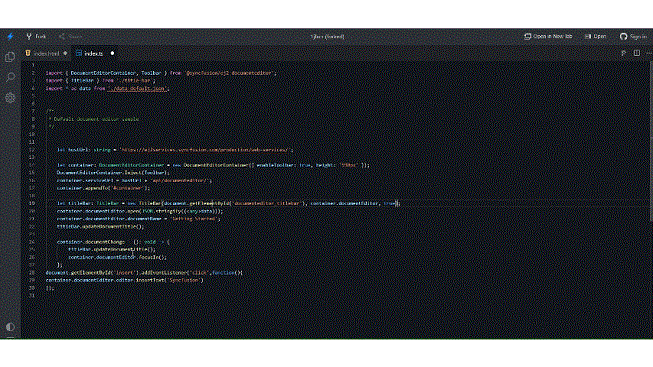

# Insert text in current position in JavaScript (ES6) Document editor

You can insert the text, paragraph and rich-text content in JavaScript Document Editor component.

## Insert text in current cursor position

You can use [`insertText`](https://ej2.syncfusion.com/documentation/api/document-editor/editor#inserttext) API in editor module to insert the text in current cursor position.

The following example illustrates how to add the text in current selection.

```ts
    let hostUrl: string = 'https://document.syncfusion.com/web-services/word-editor/';
    let container: DocumentEditorContainer = new DocumentEditorContainer({ enableToolbar: true, height: '590px' });
    DocumentEditorContainer.Inject(Toolbar);
    container.serviceUrl = hostUrl + 'api/documenteditor/';
    container.appendTo('#container');

    document.getElementById('insert').addEventListener('click',function(){
    // It will insert the provided text in current selection
    container.documentEditor.editor.insertText('Syncfusion');
    });
```

Please check below gif which illustrates how to insert text in current cursor position on button click:



## Insert paragraph in current cursor position

To insert new paragraph at current selection, you can can use [`insertText`](https://ej2.syncfusion.com/documentation/api/document-editor/editor#inserttext) API with parameter as `\r\n` or `\n`.

The following example code illustrates how to add the new paragraph in current selection.

```ts
// It will add the new paragraph in current selection
container.documentEditor.editor.insertText('\n');
```

## Insert the rich-text content

To insert the HTML content, you have to convert the HTML content to SFDT Format using [`web service`](../web-services-overview). Then use [`paste`](https://ej2.syncfusion.com/documentation/api/document-editor/editor#paste) API to insert the sfdt at current cursor position.

>Note: HTML string should be well formatted. [`DocIO`](https://help.syncfusion.com/file-formats/docio/html) support only well formatted XHTML.  

The following example illustrates how to insert the HTML content at current cursor position.

* Send the HTML content to server side for SFDT conversion. Refer to the following example to send the HTML content to server side and inserting it in current cursor position.

```ts
import {
  DocumentEditorContainer,
  Toolbar,
} from '@syncfusion/ej2-documenteditor';

let hostUrl: string =
  'https://document.syncfusion.com/web-services/word-editor/';

let container: DocumentEditorContainer = new DocumentEditorContainer({
  enableToolbar: true,
  height: '590px',
});
DocumentEditorContainer.Inject(Toolbar);
container.serviceUrl = hostUrl + 'api/documenteditor/';
container.appendTo('#container');
 
let htmltags: string =
  "<?xml version='1.0' encoding='utf - 8'?><!DOCTYPE html PUBLIC '-//W3C//DTD XHTML 1.0 Strict//EN''http://www.w3.org/TR/xhtml1/DTD/xhtml1-strict.dtd'><html xmlns ='http://www.w3.org/1999/xhtml' xml:lang='en' lang ='en'><body><h1>The img element</h1></body></html>";
document.getElementById('export').addEventListener('click', () => {
  let http: XMLHttpRequest = new XMLHttpRequest();
  http.open('POST', 'http://localhost:5000/api/documenteditor/LoadString');
  http.setRequestHeader('Content-Type', 'application/json;charset=UTF-8');
  http.responseType = 'json';
  http.onreadystatechange = function () {
    if (http.readyState === 4) {
      if (http.status === 200 || http.status === 304) {
        // Insert the sfdt content in cursor position using paste API
        container.documentEditor.editor.paste(http.response);
      } else {
        alert('failed;');
      }
    }
  };

  let htmlContent: any = { content: htmltags };
  http.send(JSON.stringify(htmlContent));
});
```

* Please refer the following code example for server-side web implementation for HTML conversion using DocumentEditor.

```c#
//API controller for the conversion.
[HttpPost]
public string LoadString([FromBody]InputParameter data)
{
    // You can also load HTML file/string from server side.
    Syncfusion.EJ2.DocumentEditor.WordDocument document = Syncfusion.EJ2.DocumentEditor.WordDocument.LoadString(data.content, FormatType.Html); // Convert the HTML to SFDT format.
    string json = Newtonsoft.Json.JsonConvert.SerializeObject(document);
    document.Dispose();
    return json;
}

public class InputParameter
{
    public string content {get; set; }
}
```

>Note: The above example illustrates inserting HTML content. Similarly, you can insert any rich-text content by converting any of the supported file formats (DOCX, DOC, WordML, HTML, RTF) to SFDT.