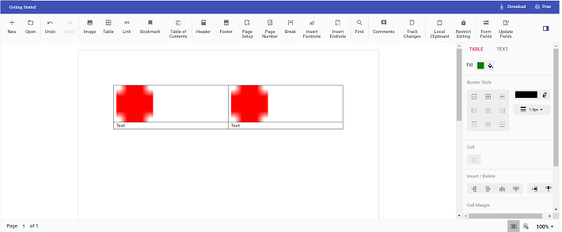

# How to Insert Text or Image in Table in TypeScript DOCX Editor

Using [TypeScript DOCX Editor](https://www.syncfusion.com/docx-editor-sdk/javascript-docx-editor) (Document Editor) APIs, you can insert [`text`](../how-to/insert-text-in-current-position#insert-text-in-current-cursor-position) or an [`image`](../image#images) in a [`table`](../table#create-a-table) programmatically based on your requirements.

Use the [`selection`](../how-to/move-selection-to-specific-position#selects-content-based-on-start-and-end-hierarchical-index) APIs to navigate between rows and cells.

The following example illustrates how to create a 2x2 table and then add text and an image programmatically.

```ts
import { DocumentEditorContainer, Toolbar } from '@syncfusion/ej2-documenteditor';

DocumentEditorContainer.Inject(Toolbar);

let container: DocumentEditorContainer = new DocumentEditorContainer({ enableToolbar: true, height: '590px' });

container.serviceUrl = 'https://document.syncfusion.com/web-services/docx-editor/api/documenteditor/';

container.appendTo('#container');
// To insert the table at the cursor position
container.documentEditor.editor.insertTable(2,2);
// To insert the image at the table's first cell
container.documentEditor.editor.insertImage("data:image/png;base64,iVBORw0KGgoAAAANSUhEUgAAAAUAAAAFCAYAAACNbyblAAAAHElEQVQI12P4    //8/w38GIAXDIBKE0DHxgljNBAAO9TXL0Y4OHwAAAABJRU5ErkJggg==");
// To move the cursor to the next cell
moveCursorToNextCell();
// To insert the image at the table's second cell
container.documentEditor.editor.insertImage("data:image/png;base64,iVBORw0KGgoAAAANSUhEUgAAAAUAAAAFCAYAAACNbyblAAAAHElEQVQI12P4    //8/w38GIAXDIBKE0DHxgljNBAAO9TXL0Y4OHwAAAABJRU5ErkJggg==");
// To move the cursor to the next row
moveCursorToNextRow();
// To insert text at the cursor position
container.documentEditor.editor.insertText('Text');
// To move the cursor to the next cell
moveCursorToNextCell();
// To insert text at the cursor position
container.documentEditor.editor.insertText('Text');

function moveCursorToNextCell() {
// To get the current selection start offset
let startOffset = container.documentEditor.selection.startOffset;
// Increasing the cell index to consider the next cell
let cellIndex = parseInt(startOffset.substring(6, 7)) + 1;
// Changing the start offset
startOffset = startOffset.substring(0, 6) + cellIndex.toString() + startOffset.substring(7, startOffset.length);
// Navigating the selection using the select method
container.documentEditor.selection.select(startOffset, startOffset);
}

function moveCursorToNextRow() {
// To get the current selection start offset
let startOffset = container.documentEditor.selection.startOffset;
// Increasing the row index to consider the next row
let rowIndex = parseInt(startOffset.substring(4, 5)) + 1;
let cellIndex = parseInt(startOffset.substring(6,7)) != 0 ? parseInt(startOffset.substring(6,7)) - 1 : 0;
// Changing the start offset
startOffset = startOffset.substring(0, 4) + rowIndex.toString() + startOffset.substring(5, 6) + cellIndex + startOffset.substring(7, startOffset.length);
// Navigating the selection using the select method
container.documentEditor.selection.select(startOffset, startOffset);
}
```

N> The Web API hosted link `https://document.syncfusion.com/web-services/docx-editor/api/documenteditor/` utilized in the Document Editor's serviceUrl property is intended solely for demonstration and evaluation purposes. For production deployment, please host your own web service with your required server configurations. You can refer and reuse the [GitHub Web Service example](https://github.com/SyncfusionExamples/EJ2-DocumentEditor-WebServices) or [Docker image](https://hub.docker.com/r/syncfusion/word-processor-server) for hosting your own web service and use for the serviceUrl property.

The output will be as shown below.

