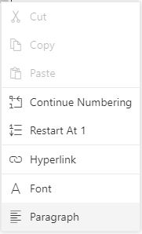

# List format in JavaScript (ES6) Document editor control

Document Editor supports both the single-level and multilevel lists. Lists are used to organize data as step-by-step instructions in documents for easy understanding of key points. You can apply list to the paragraph either using supported APIs.

## Create bullet list

Bullets are usually used for unordered lists. To apply bulleted list for selected paragraphs, use the following method of ‘Editor’ instance.

> applyBullet(bullet, fontFamily);

|Parameter|Type|Description|
|---------|----|-----------|
|Bullet|string|Bullet character.|
|fontFamily|string|Bullet font family.|

Refer to the following sample code.

```ts
documenteditor.editor.applyBullet('\uf0b7', 'Symbol');
```

## Create numbered list

Numbered lists are usually used for ordered lists. To apply numbered list for selected paragraphs, use the following method of ‘Editor’ instance.

> applyNumbering(numberFormat,listLevelPattern)

|Parameter|Type|Description|
|---------|----|-----------|
|numberFormat|string|“%n” representations in ‘numberFormat’ parameter will be replaced by respective list level’s value.“%1)” will be displayed as “1)”|
|listLevelPattern(optional)|string|Default value is 'Arabic'.|

Refer to the following example.

```ts
documenteditor.editor.applyNumbering('%1)', 'UpRoman');
```

## Clear list

You can also clear the list formatting applied for selected paragraphs. Refer to the following sample code.

```ts
documenteditor.editor.clearList();
```

## Working with lists

The following sample demonstrates how to create bullet and numbering lists in Document Editor.

 

 







        


## Editing numbered list

Document Editor restarts the numbering or continue numbering for a numbered list. These options are found in the built-in context menu, if the list value is selected. Refer to the following screenshot.



## See Also

* [List dialog](./dialog#list-dialog)
