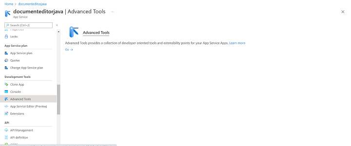
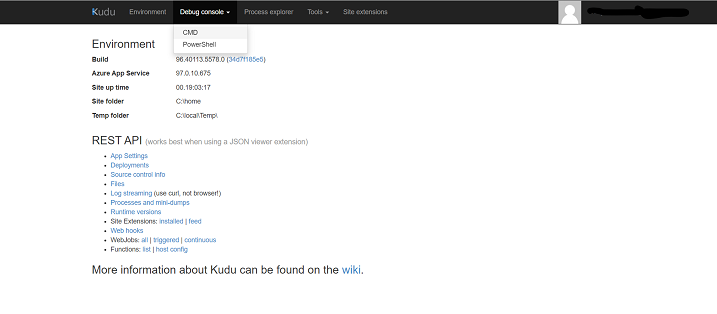
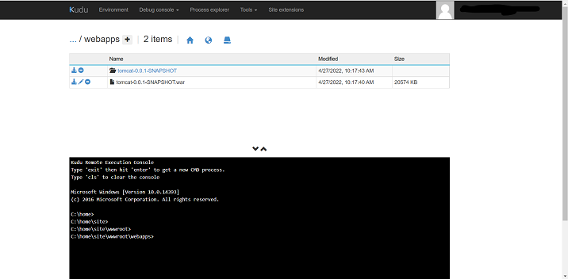

# Deploy Document Editor Java Web API in Azure

## Prerequisites

Have an [`Azure account`](https://azure.microsoft.com/en-gb/) and [`Azure CLI`](https://docs.microsoft.com/en-us/cli/azure/?view=azure-cli-latest) set up in your environment.

You can get the example web service project [from GitHub](https://github.com/SyncfusionExamples/EJ2-DocumentEditor-Java-WebService) and then perform the following steps to create the packages and host in the Azure app service.

**Step 1:** Clean the package using the following command.

```console
mvn clean package
```

**Step 2:** Run the application locally using the following command.

```console
mvn spring-boot:run
```

**Step 3:** Build the package using the following command.

```console
mvn package
```

The above package generation command creates the `tomcat-0.0.1-SNAPSHOT.war` in the following location in the sample folder.

`target/tomcat-0.0.1-SNAPSHOT.war`

**Step 4:** Create an Azure app service with Java & Tomcat. For example, create the app service name as `documenteditorjava`.

**Step 5:** After creating the app service, navigate to `Advanced Tools` options under `Development Tools`.



Then, click `Go` and select the `CMD` options under `Debug console`.



**Step 6:** Once the file manager is opened, please navigate to

`site -> wwwroot -> webapps`

**Step 7:** Now, upload the generated war file `tomcat-0.0.1-SNAPSHOT.war`. The uploaded war file gets extracted automatically and is shown as below:



**Step 8:** Browse to the app.

Browse to the deployed app at `http://<app_name>.azurewebsites.net`, for example, `http://documenteditorjava.azurewebsites.net`. Browse this link, and it will navigate to the Document Editor Web API control `http://documenteditorjava.azurewebsites.net/tomcat-0.0.1-SNAPSHOT`. It returns the default GET method response.

Append the app service running URL `http://documenteditorjava.azurewebsites.net/tomcat-0.0.1-SNAPSHOT` to the service URL in the client-side Document Editor control. For more information about the Document Editor control, refer to this [getting started page](../getting-started).