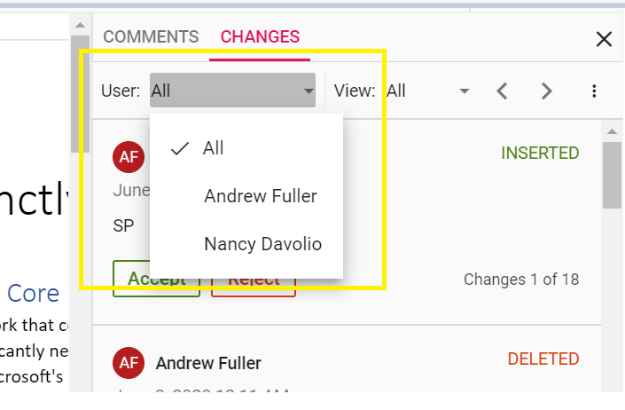

# Track changes in JavaScript (ES6) Document editor control

Track Changes allows you to keep a record of changes or edits made to a document. You can then choose to accept or reject the modifications. It is a useful tool for managing changes made by several reviewers to the same document. If track changes option is enabled, all editing operations are preserved as revisions in Document Editor.

## Enable track changes in Document Editor

The following example demonstrates how to enable track changes.

 

```ts
let container: DocumentEditorContainer = new DocumentEditorContainer({
  enableTrackChanges: true,
});
container.appendTo('#container');
```


>Track changes are document level settings. When opening a document, if the document does not have track changes enabled, then enableTrackChanges will be disabled even if we set enableTrackChanges : true in the initial rendering. If you want to enable track changes for all the documents, then we recommend enabling track changes during the document change event. The following example demonstrates how to enable Track changes for the all the Document while Opening.

 

```ts
container.documentChange = (): void => {
  if (container !== null) {
    container.documentEditor.enableTrackChanges = true;
  }
};
```


## Show/Hide Revisions Pane
 
The Show/Hide Revisions Pane feature in the Document Editor allows users to toggle the visibility of the revisions pane, providing flexibility in managing tracked changes within the document.
 
The following example code illustrates how to show/hide the revisions pane.

 

```ts

import { DocumentEditorContainer, Toolbar } from '@syncfusion/ej2-documenteditor';
DocumentEditorContainer.Inject(Toolbar);
let container: DocumentEditorContainer = new DocumentEditorContainer({
  enableTrackChanges: true,
});
container.serviceUrl = 'https://document.syncfusion.com/web-services/docx-editor/api/documenteditor/';
container.appendTo('#container');
container.documentEditor.showRevisions = true; // To show revisions pane
container.documentEditor.showRevisions = false; // To hide revisions pane

```


> The Web API hosted link `https://document.syncfusion.com/web-services/docx-editor/api/documenteditor/` utilized in the Document Editor's serviceUrl property is intended solely for demonstration and evaluation purposes. For production deployment, please host your own web service with your required server configurations. You can refer and reuse the [GitHub Web Service example](https://github.com/SyncfusionExamples/EJ2-DocumentEditor-WebServices) or [Docker image](https://hub.docker.com/r/syncfusion/word-processor-server) for hosting your own web service and use for the serviceUrl property.

## Get all tracked revisions

The following example demonstrate how to get all tracked revision from current document.

 

```ts
let container: DocumentEditorContainer = new DocumentEditorContainer({
  enableTrackChanges: true,
});
container.appendTo('#container');
/**
 * Get revisions from the current document
 */
let revisions : RevisionCollection = container.documentEditor.revisions;
```


## Accept or Reject all changes programmatically

The following example demonstrates how to accept/reject all changes.

 

```ts
let container: DocumentEditorContainer = new DocumentEditorContainer({
  enableTrackChanges: true,
});
container.appendTo('#container');
/**
 * Get revisions from the current document
 */
let revisions : RevisionCollection = container.documentEditor.revisions;

/**
 * Accept all tracked changes
 */
revisions.acceptAll();

/**
 * Reject all tracked changes
 */
revisions.rejectAll();
```


## Accept or reject a specific revision

The following example demonstrates how to accept/reject specific revision in the Document Editor.

 

```ts
/**
 * Get revisions from the current document
 */
let revisions : RevisionCollection = container.documentEditor.revisions;
/**
 * Accept specific changes
 */
revisions.get(0).accept();
/**
 * Reject specific changes
 */
revisions.get(1).reject();
```


## Navigate between the tracked changes

The following example demonstrates how to navigate tracked revision programmatically.

 

```ts

import { DocumentEditorContainer, Toolbar } from '@syncfusion/ej2-documenteditor';
DocumentEditorContainer.Inject(Toolbar);
let container: DocumentEditorContainer = new DocumentEditorContainer({
  enableTrackChanges: true,
});
container.appendTo('#container');
/**
 * Navigate to next tracked change from the current selection.
 */
container.documentEditor.selection.navigateNextRevision();

/**
 * Navigate to previous tracked change from the current selection.
 */
container.documentEditor.selection.navigatePreviousRevision();
```


## Filtering changes based on user

In DocumentEditor, we have built-in review panel in which we have provided support for filtering changes based on the user.



## Custom metadata along with author

The Document Editor provides options to customize revisions using [`revisionSettings`](https://ej2.syncfusion.com/documentation/api/document-editor/documenteditorsettingsmodel#revisionsettings). The [`customData`](https://ej2.syncfusion.com/documentation/api/document-editor/revisionsettings#customdata) property allows you to attach additional metadata to tracked revisions in the Word Processor. This metadata can represent roles, tags, or any custom identifier for the revision. To display this metadata along with the author name in the Track Changes pane, you must enable the [`showCustomDataWithAuthor`](https://ej2.syncfusion.com/documentation/api/document-editor/revisionsettings#showcustomdatawithauthor) property.

The following example code illustrates how to enable and update custom metadata for track changes revisions.

```ts
import { DocumentEditorContainer, Ribbon } from '@syncfusion/ej2-documenteditor';
let container: DocumentEditorContainer = new DocumentEditorContainer({ 
  height: '590px',
  serviceUrl= hostUrl, 
  enableTrackChanges=true,
  documentEditorSettings: {
    revisionSettings: { customData : "Developer", showCustomDataWithAuthor : true }}
});
DocumentEditorContainer.Inject(Ribbon);
container.appendTo('#container');
```

The Track Changes pane will display the author name along with the custom metadata, as shown in the screenshot below.


>Note:
* When you export the document as SFDT, the customData value is stored in the revision collection. When you reopen the SFDT, the custom data is automatically restored and displayed in the Track Changes pane.
* Other than SFDT export (e.g. DOCX and other), the customData is not preserved, as it is specific to the Document Editor component.

## Protect the document in track changes only mode

Document Editor provides support for protecting the document with `RevisionsOnly` protection. In this protection, all the users are allowed to view the document and do their corrections, but they cannot accept or reject any tracked changes in the document. Later, the author can view their corrections and accept or reject the changes.

Document editor provides an option to protect and unprotect document using [`enforceProtection`](https://ej2.syncfusion.com/documentation/api/document-editor/editor#enforceprotection) and [`stopProtection`](https://ej2.syncfusion.com/documentation/api/document-editor/editor#stopprotection) API.

The following example code illustrates how to enforce and stop protection in Document editor container.

 

```ts

import { DocumentEditorContainer, Toolbar } from '@syncfusion/ej2-documenteditor';
DocumentEditorContainer.Inject(Toolbar);
let container: DocumentEditorContainer = new DocumentEditorContainer({
  enableToolbar: true,
  height: '590px',
});
container.serviceUrl = 'http://localhost:5000/api/documenteditor/';
container.appendTo('#container');

//enforce protection
container.documentEditor.editor.enforceProtection('123', 'RevisionsOnly');

//stop the document protection
container.documentEditor.editor.stopProtection('123');
```

Tracked changes only protection can be enabled in UI by using [Restrict Editing pane](./document-management#restrict-editing-pane)


>Note: In enforce Protection method, first parameter denotes password and second parameter denotes protection type. Possible values of protection type are `NoProtection |ReadOnly |FormFieldsOnly |CommentsOnly |RevisionsOnly`. In stop protection method, parameter denotes the password.

## Events

DocumentEditor provides [beforeAcceptRejectChanges](https://ej2.syncfusion.com/documentation/api/document-editor-container#beforeacceptrejectchanges) event, which is triggered before a tracked content is accepted or rejected. This event provides an opportunity to perform custom logic before accepting or rejecting changes. The event handler receives the [RevisionActionEventArgs](https://ej2.syncfusion.com/documentation/api/document-editor/revisionActionEventArgs) object as an argument, which allows access to information about the tracked content. . 

To demonstrate a specific use case, let's consider an example where we want to restrict the accept and reject changes functionality based on the author name. The following code snippet illustrates how to allow only the author of the tracked content to accept or reject changes:

 

```ts

import { DocumentEditorContainer, Toolbar } from '@syncfusion/ej2-documenteditor';
DocumentEditorContainer.Inject(Toolbar);
let container: DocumentEditorContainer = new DocumentEditorContainer({ 
  beforeAcceptRejectChanges: beforeAcceptRejectChanges.bind(this),
  enableToolbar: true,
  height: '590px',
  currentUser: 'Hary'
});
container.appendTo('#container');

// Event get triggerd before accepting/rejecting changes
function beforeAcceptRejectChanges(args : RevisionActionEventArgs) : void {
  // Check the author of the revision and current user are different
  if (args.author !== container.currentUser) {
    // Cancel the accept/reject action
    args.cancel = true;
  }
}
```

