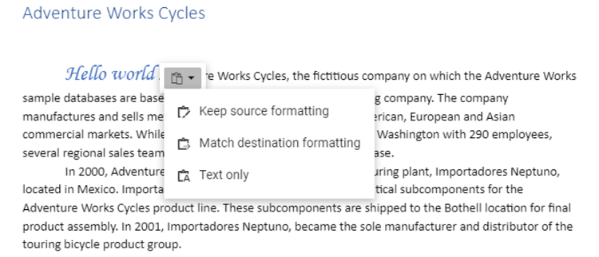

# Clipboard in React Document editor component

[React Document Editor](https://www.syncfusion.com/docx-editor-sdk/react-docx-editor) (Document Editor) takes advantage of the system clipboard and allows you to copy or move portions of the document to the clipboard in HTML format, so that it can be pasted into any application that supports clipboard operations.

## Copy

Copy a portion of the document to the system clipboard using the built-in context menu of the Document Editor. You can also do it programmatically using the following sample code.

```ts
documentEditor.selection.copy();
```

## Cut

Cut a portion of the document to the system clipboard using the built-in context menu of the Document Editor. You can also do it programmatically using the following sample code.

```ts
documentEditor.editor.cut();
```

## Paste

Due to limitations, you can paste contents from the system clipboard into the Document Editor only using the **Ctrl + V** keyboard shortcut.

N> Due to browser limitations of getting content from the system clipboard, paste using the API and context menu options doesn't work.

## Local paste (copy/paste within control)

Document Editor exposes an API to enable local paste within the control. When enabled, the following occurs:
* Selected contents will be stored to an internal clipboard as SFDT in addition to the system clipboard.
* Clipboard paste will be overridden, and the internally stored data (SFDT data) that has formatted text will be pasted using the `paste()` API in the Document Editor.

### Enable Local Paste

Refer to the following sample code.

```ts
import * as React from 'react';
import { createRoot } from 'react-dom/client';
import {
  DocumentEditorComponent,
  SfdtExport,
  Selection,
  Editor,
} from '@syncfusion/ej2-react-documenteditor';

//Inject required modules.
DocumentEditorComponent.Inject(Selection, Editor);

function App() {
  let documenteditor;
  React.useEffect(() => {
    //Enable document editor local paste option.
    documenteditor.enableLocalPaste = true;
  }, []);
  return (
    <div>
      <DocumentEditorComponent
        id="container"
        ref={(scope) => {
          documenteditor = scope;
        }}
        isReadOnly={false}
        enableSelection={true}
        enableEditor={true}
      />
    </div>
  );
}
export default App;
const root = createRoot(document.getElementById('sample')!);
root.render(<App />);
```

By default, **enableLocalPaste** is false.
When local paste is enabled for a document editor instance, you can paste contents programmatically if the internal clipboard has stored data during last copy operation. Refer to the following sample code.

```ts
documentEditor.editor.paste();
```

### Paste options in context menu

In the Document Editor, paste options in the context menu will be in a disabled state if you try to copy/paste content from outside of the Document Editor. It gets enabled when `enableLocalPaste` is `true` and you copy/paste content within the Document Editor.

N> Due to browser limitations of getting content from the system clipboard, paste using the API and context menu options doesn't work. Hence, the paste option is disabled in the context menu.

Alternatively, you can use the keyboard shortcuts:

* Cut: Ctrl + X
* Copy: Ctrl + C
* Paste: Ctrl + V

### EnableLocalPaste behavior

|**EnableLocalPaste** |**Paste behavior details**|
|--------------------------|----------------------|
|True |Allows to paste content that is copied from the same Document Editor component alone and prevents pasting content from system clipboard. Hence the content copied from outside Document Editor component can’t be pasted.<br>Browser limitation of pasting from system clipboard using API and context menu options, will be resolved. So, you can copy and paste content within the Document Editor component using API and context menu options too.|
|False|Allows to paste content from system clipboard. Hence the content copied from both the Document Editor component and outside can be pasted.<br>Browser limitation of pasting from system clipboard using API and context menu options, will remain as a limitation.|

N>
* Keyboard shortcut for pasting will work properly in both cases.
* Copying content from the Document Editor component and pasting outside will work properly in both cases.

## Paste with formatting

Document Editor provides support to paste the system clipboard data with formatting. To enable clipboard paste with formatting options, set the `enableLocalPaste` property in the Document Editor to `false` and use the `Syncfusion.EJ2.WordEditor.AspNet.Core` .NET Standard library for the ASP.NET Core web API service implementation. This library helps you to paste the system clipboard data with formatting. For details on setting up the web API service, refer to the [web services overview](./web-services-overview).

You can paste your system clipboard data in the following ways:

* **Keep Source Formatting:** This option retains the character styles and direct formatting applied to the copied text. Direct formatting includes characteristics such as font size, italics, or other formatting that is not included in the paragraph style.
* **Match Destination Formatting:** This option discards most of the formatting applied directly to the copied text, but it retains the formatting applied for emphasis, such as bold and italic when it is applied to only a portion of the selection. The text takes on the style characteristics of the paragraph where it is pasted. The text also takes on any direct formatting or character style properties of text that immediately precedes the cursor when the text is pasted.
* **Text Only:** This option discards all formatting and non-text elements such as pictures or tables. The text takes on the style characteristics of the paragraph where it is pasted and takes on any direct formatting or character style properties of text that immediately precedes the cursor when the text is pasted. Graphical elements are discarded, and tables are converted to a series of paragraphs.

This paste option appears as follows.



N> When you paste content from an external source into the Document Editor, some formatting or elements may not appear as expected because certain elements are not supported. Refer [here](./unsupported-features) to learn more about unsupported elements.

## See Also

* [Feature modules](./feature-module)
* [Keyboard shortcuts](./keyboard-shortcut#clipboard)