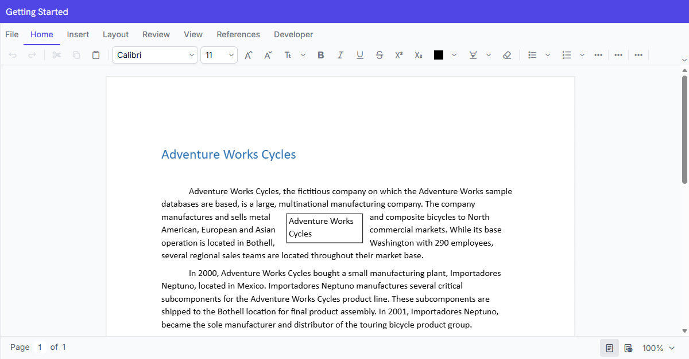

# Getting started with React DOCX Editor

[React DOCX Editor](https://www.syncfusion.com/docx-editor-sdk/react-docx-editor) (Document Editor) enables you to create, edit, view, and print Word documents in web applications. This section guides you through the steps to get started and create a DOCX Editor in a React application.





## Prerequisites

- [Node.js 24+](https://nodejs.org/en) (LTS recommended).
- Syncfusion CLI.

## Install the Syncfusion CLI 

Install the Syncfusion CLI globally using the following command:




npm install -g @syncfusion/syncfusion-cli




## Set up the Vite project using Syncfusion CLI

You can create a React Vite application using the Syncfusion CLI. The CLI provides two ways to create a project:

### Non-interactive mode

Non-interactive mode allows you to create a project directly using a single command with the required command-line arguments.




sf new syncfusion-react-app --framework react --template DOCX-Editor --theme tailwind3




In this mode, the project configuration is passed directly in the command. The above command creates a React Vite application configured with the Syncfusion<sup style="font-size:70%">&reg;</sup> `DOCX Editor` component.

### Interactive mode

Interactive mode guides you through the project creation process with step-by-step prompts.




sf




When you run the `sf` command, the CLI prompts you to select the required project configuration. To create a React Vite application with the Syncfusion<sup style="font-size:70%">&reg;</sup> `DOCX Editor` component, select the following options:




√ Project name? ... Syncfusion-react-app
√ Choose Framework: » React
√ Choose Build Tool: » Vite
√ Choose Language: » JavaScript
√ Choose Template: » DOCX-Editor
√ Choose Theme: » Tailwind3
√ Choose Style Format: » CSS
√ Would you like to integrate the Syncfusion MCP Server (AI Assistant) into this project? ... no
√ Would you like to install Syncfusion Component Skills for AI-powered development? ... no      
√ Install dependencies and start app now? ... no




The above selections generate a React Vite application configured with the Syncfusion<sup style="font-size:70%">&reg;</sup> `DOCX Editor` component. You can choose different values for language, theme, style format, MCP setup, and skills installation based on your project requirements.

The Syncfusion<sup style="font-size:70%">&reg;</sup> CLI creates the project with a predefined template. After the project is generated, you can customize or replace the component code based on your application requirements.

## Run the project

Once the project is created, navigate to the project directory and run the following commands in your terminal.




cd syncfusion-react-app
npm install
npm run dev




The output will appear as follows:







## Prerequisites



* [System requirements for React components](https://ej2.syncfusion.com/react/documentation/system-requirement)
* [Browser Compatibility](https://ej2.syncfusion.com/react/documentation/browser)



* [System requirements for DOCX Editor](https://ej2.syncfusion.com/react/documentation/system-requirement)
* [Browser Compatibility](https://ej2.syncfusion.com/react/documentation/browser)



## Create a new React application

To set up a React application, run the following commands:




npm create vite@latest documenteditor-app -- --template react-ts
cd documenteditor-app





npm create vite@latest documenteditor-app -- --template react
cd documenteditor-app




## Install the React DOCX Editor npm package

The DOCX Editor package is available in the public npm registry and can be installed directly from [`npmjs.com`](https://www.npmjs.com/package/@syncfusion/ej2-react-documenteditor).


To install the DOCX Editor component, use the following command:

```bash
npm install @syncfusion/ej2-react-documenteditor --save
```

## Register a Syncfusion License Key

Before initializing the React DOCX Editor control, generate a Syncfusion license key and register it in your application.

- [Generate a Syncfusion License Key](https://help.syncfusion.com/document-processing/licensing/how-to-generate)
- [Register a Syncfusion License Key in React](https://ej2.syncfusion.com/react/documentation/licensing/license-key-registration)

## Import the required CSS styles

Add the DOCX Editor component and its dependent component styles available in the `node_modules/@syncfusion` package folder. Reference these styles in the `src/index.css` file.




@import '../node_modules/@syncfusion/ej2-base/styles/tailwind3.css';
@import '../node_modules/@syncfusion/ej2-buttons/styles/tailwind3.css';
@import '../node_modules/@syncfusion/ej2-inputs/styles/tailwind3.css';
@import '../node_modules/@syncfusion/ej2-popups/styles/tailwind3.css';
@import '../node_modules/@syncfusion/ej2-lists/styles/tailwind3.css';
@import '../node_modules/@syncfusion/ej2-navigations/styles/tailwind3.css';
@import '../node_modules/@syncfusion/ej2-splitbuttons/styles/tailwind3.css';
@import '../node_modules/@syncfusion/ej2-dropdowns/styles/tailwind3.css';
@import '../node_modules/@syncfusion/ej2-react-documenteditor/styles/tailwind3.css';




N> This example uses the `Tailwind 3` theme. To use a different built-in theme, replace the `tailwind3.css` references with the corresponding theme stylesheets. Refer to the [Themes documentation](https://ej2.syncfusion.com/react/documentation/appearance/theme) for information about the available themes and the different ways to include theme styles in a React application.

## Initialize the DOCX Editor

Add the DOCX Editor component to your application. Add the following code to initialize the component:




import * as React from 'react';
import {
  DocumentEditorContainerComponent,
  Toolbar
} from '@syncfusion/ej2-react-documenteditor';

DocumentEditorContainerComponent.Inject(Toolbar);

function App() {
  return (
<DocumentEditorContainerComponent 
            id="container" 
            height="590px" 
            // Use the following service URL only for demo purposes
            serviceUrl="https://document.syncfusion.com/web-services/docx-editor/api/documenteditor/" 
            enableToolbar={true}
        />
  );
}

export default App;





import { DocumentEditorContainerComponent, Toolbar } from '@syncfusion/ej2-react-documenteditor';

DocumentEditorContainerComponent.Inject(Toolbar);

function App() {
    return (
        <DocumentEditorContainerComponent 
            id="container" 
            height="590px" 
            // Use the following service URL only for demo purposes
            serviceUrl="https://document.syncfusion.com/web-services/docx-editor/api/documenteditor/" 
            enableToolbar={true}
        />
    );
}

export default App;




N> The hosted Web API URL is for demo and evaluation purposes only. For production, host your own web service using the [GitHub Web Service example](https://github.com/SyncfusionExamples/EJ2-DocumentEditor-WebServices) or the [Docker image](https://hub.docker.com/r/syncfusion/word-processor-server).

## Run the application

Run the application using the following command:

```bash
npm run dev
```

After the application starts, open the localhost URL shown in the terminal. The React DOCX Editor is rendered in the browser with a toolbar and an editable document area, as shown below.


You can also explore the DOCX Editor interactively using the live sample below.
        


N> [View Sample in GitHub](https://github.com/SyncfusionExamples/React-DOCX-Editor-Examples/tree/master/getting-started).





## Online Demo

Explore how to create, edit, and print Word documents using the React DOCX Editor in this live demo [here](https://document.syncfusion.com/demos/docx-editor/react/#/tailwind3/document-editor/default).

## Video tutorial

Follow this quick walkthrough to install, configure, and start using the React DOCX Editor in your application.



## Server-side dependencies

The DOCX Editor component requires server-side interactions for the following operations:

* Open file formats other than SFDT
* Paste with formatting
* Restrict editing
* Spell check
* Save as file formats other than SFDT and DOCX

N> If you don't require the above functionalities, you can deploy the component as a pure client-side solution without any server-side interactions.

For detailed information about server-side dependencies, refer to the [Web Services Overview](./web-services-overview) page.

N> Looking for the full React DOCX Editor component overview, features, pricing, and documentation? Visit the [React DOCX Editor](https://www.syncfusion.com/docx-editor-sdk/react-docx-editor) page.

## See also

- [Open a document](./import)
- [Save a document](./export)
- [Collaborative Editing](./collaborative-editing/overview)
- [Troubleshooting](https://help.syncfusion.com/document-processing/word/word-processor/react/troubleshooting)