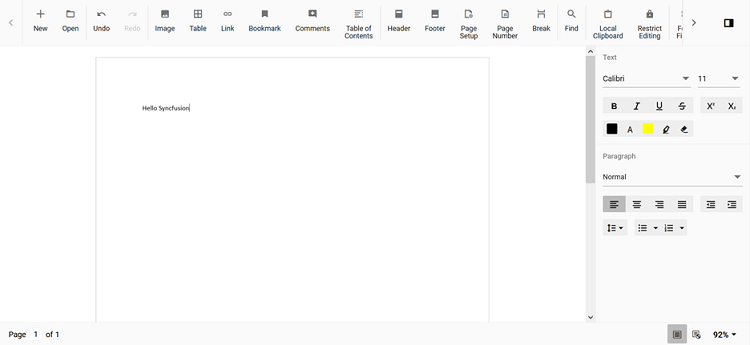

# Change the cursor color in the React Document Editor component

The default cursor color of the [React Document Editor](https://www.syncfusion.com/docx-editor-sdk/react-docx-editor) (Document Editor) is black. The user can change the color by overriding the CSS property using the class name. The Document Editor cursor CSS has a class named `e-de-blink-cursor`.

Please refer to the below code snippet to change the cursor color to red.

```css
.e-de-blink-cursor {
border-left: 1px solid red !important;
}
```

Output will be like below:


